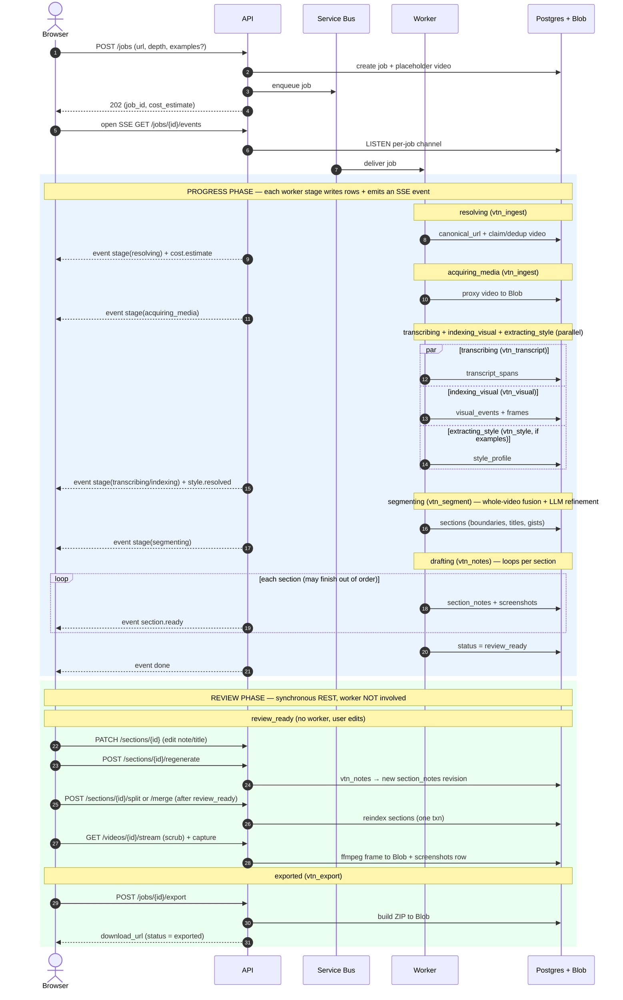
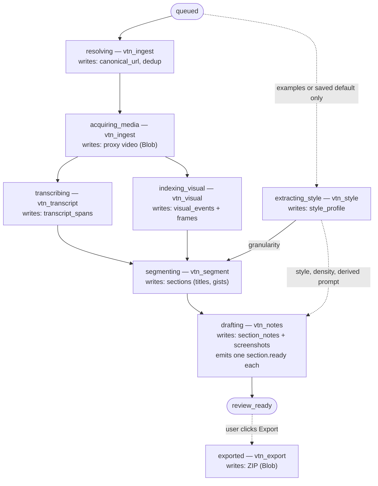

# Video-to-Note Design

> Status: detailed / implementation-ready draft. Supersedes the high-level design of the
> same date. Forks decided during brainstorming are recorded in **Decided defaults**.
> Deepened (2026-06-02) with: fusion/alignment algorithm, cost model, latency budgets,
> review mutation semantics, auth/SSE/local-dev/migrations, and few-shot output examples
> (the `extracting_style` stage + unified detail profile).

## Overview

Video-to-Note is a single-user, Azure-first web application that turns public conference
session videos into reviewed markdown notes with screenshots. The first target sources are
YouTube, Microsoft Build, and Microsoft Ignite session URLs. The first output is a
downloadable ZIP containing a markdown file and screenshot assets referenced by relative
paths.

The product is optimized for a personal learning workflow. It produces detailed, editable
drafts for sessions the user is learning from, while still supporting lighter summaries. The
system drafts automatically, then **requires human review before export** so the user can
fix missed screenshots, section boundaries, and note detail.

To keep perceived latency low, the pipeline **streams sections into the review UI as soon as
each is drafted** (progressive review). The user can begin reviewing early sections while
later ones are still being generated. While the job is still drafting (`status='active'`),
review is limited to **content edits that cannot collide with worker writes** — markdown edits
and screenshot caption/selection/order edits on already-`ready` sections. **Structural edits
that change section boundaries — split, merge, and boundary time-range edits — are disabled
until the job reaches `status='review_ready'`**, because the worker may still be drafting and
reindexing sections whose `order_index`/boundaries those edits would mutate (see **Review
mutation semantics** and the `409 job_not_review_ready` API rule).

## Goals

- Accept public YouTube, Microsoft Build, and Microsoft Ignite video URLs.
- Generate markdown notes with relevant, deduplicated screenshots.
- Support note depth choices: Thorough, Balanced, Brief, and custom prompting.
- Automatically process mixed session formats (slide talks, demos, Q&A, speaker changes,
  visually dense sections) without asking the user to classify the session.
- Provide a review UI for editing notes, adjusting sections, regenerating a single section,
  and capturing missing screenshots at arbitrary timestamps before export.
- Stream draft results progressively to minimize perceived latency.
- Deploy as an Azure-first production-style application with frontend, backend, worker,
  infrastructure, CI/CD, observability, and secure configuration.
- Keep AI providers behind adapters so non-Azure services can be benchmarked/swapped when
  they materially improve quality (especially image/video/multimodal).

## Non-goals for v1

- Multi-user workspaces, sharing, comments, or permissions.
- Fully unattended batch processing of many videos.
- Direct publishing to GitHub, OneDrive, SharePoint, or a team knowledge base.
- Real-time processing while a session is still live.
- Pixel-perfect note formatting for every downstream markdown tool.

---

## Decided defaults

These forks were resolved during brainstorming and are binding for v1:

| Area | Decision |
| --- | --- |
| Result delivery | **Progressive review** — sections stream to the UI as drafted. |
| Streaming transport | **Server-Sent Events (SSE)** for job progress and section events. |
| Segmentation | **Hybrid** — uniform signal interface + config weights (recall), single LLM refinement pass (precision/labeling). |
| Heuristic extensibility | Few general detectors behind one interface; per-speech variation handled by the LLM refinement prompt, not by growing rules. |
| Media acquisition | **Download once** (yt-dlp), sample frames locally with ffmpeg; store a proxy copy in Blob. |
| Manual capture | **Backend frame-on-demand** — review streams the stored video; capture calls ffmpeg to extract the exact frame at a timestamp. Requires the proxy; unavailable once it expires (degraded state) until re-acquired (see **Data retention**). |
| Note generation granularity | **One LLM call per section** (enables progressive streaming + per-section regeneration). |
| Screenshot dedup | Perceptual hashing (pHash) to drop near-duplicate frames. |
| Frontend | React + Next.js (App Router). |
| Backend/worker | Python; FastAPI for the API, shared packages for ingestion/media/AI/export. |
| Queue | Azure Service Bus with dead-letter queue. |
| Metadata store | Azure PostgreSQL Flexible Server. |
| Model access | Azure AI Foundry by default; provider adapters for non-Azure benchmarking. |
| Embeddings | Azure OpenAI embedding deployment (via Foundry) for semantic-shift detection. |
| Auth | Single shared username/password (hash in Key Vault) → signed httpOnly **session cookie**; SSE authenticates via the cookie automatically. |
| Cost policy | **Warn, never block** — estimate up front, show it, always proceed; record actuals. |
| Latency target | **Time-to-first-section (TTFS) ≤ ~1–2 min** for a 1-hr captioned video; captions-first is the latency lever. |
| Queue abstraction | `QueueProvider` interface — Azure Service Bus in cloud, in-memory/SQLite queue locally. |
| Migrations | **Alembic**, versioned in repo; `alembic upgrade head` as a CD step. |
| Local dev | `docker-compose` (Postgres + Azurite) + a `fake` AI provider profile for offline, zero-spend runs. |
| Re-submit dedup | Reuse a video's proxy + transcript artifacts across jobs when `canonical_url` already processed; always create a new job. |
| Output examples (few-shot) | Optional per-job example notes (paste/upload `.md`), distilled once into a **style profile**; can be saved as the user's default for future jobs. |
| Detail profile | `depth` and examples both feed one profile of {segmentation granularity, note density, style, derived prompt}. Examples win **per-dimension by extraction confidence**; `depth` is the fallback. |

---

## Architecture

```text
                 ┌────────────┐        ┌──────────────────────┐
  Browser  ◄────►│  Frontend  │◄──SSE──│        API           │
 (Next.js)       │  (Next.js) │  REST  │   (FastAPI, ACA app) │
                 └────────────┘        └──────────┬───────────┘
                                                  │ enqueue job
                                                  ▼
                                        ┌──────────────────────┐
                                        │  Azure Service Bus    │
                                        │  (jobs + dead-letter) │
                                        └──────────┬───────────┘
                                                  │ trigger
                                                  ▼
                                        ┌──────────────────────┐
                                        │  Worker               │
                                        │ (ACA Job, Python)     │
                                        │  yt-dlp / ffmpeg /    │
                                        │  AI adapters          │
                                        └──┬───────────┬───────┘
                                           │           │
                          ┌────────────────┘           └───────────────┐
                          ▼                                            ▼
                 ┌──────────────────┐                       ┌─────────────────────┐
                 │ Azure Blob       │                       │ Azure PostgreSQL    │
                 │ (video proxy,    │                       │ (jobs, sections,    │
                 │  frames, exports)│                       │  notes, screenshots)│
                 └──────────────────┘                       └─────────────────────┘

 Cross-cutting: Key Vault (secrets + shared credential hash + cookie-signing secret),
                Managed Identity (service-to-service auth), Application Insights (telemetry),
                Azure AI Foundry (models + embeddings), Azure AI Speech / Vision / Document Intelligence.
                User-facing auth: a single shared login → signed httpOnly session cookie.
```

### Component responsibilities

- **Frontend (Next.js App Router)**: submit form, progress view (SSE consumer), review editor
  (section list, markdown editor, video scrubber, screenshot tray), export trigger/download.
- **API (FastAPI on Azure Container Apps)**: validates submissions, creates the `job` plus a
  placeholder `videos` row (keyed on `source_url`; `canonical_url` is resolved later by the
  worker), enqueues work, exposes job/section/screenshot/export endpoints, relays progress via
  SSE, serves stored video range requests and frame-on-demand, builds export ZIPs.
- **Worker (Azure Container Apps Job, Python)**: the pipeline. Consumes a Service Bus message,
  runs stages, writes artifacts to Blob and rows to PostgreSQL, and emits progress events the
  API forwards over SSE.
- **Service Bus**: decouples API from worker; provides retry + dead-letter.
- **Blob Storage**: video proxy, extracted frames/screenshots, markdown drafts, export ZIPs.
- **PostgreSQL**: relational, timeline-ordered metadata and review edit history.

### End-to-end sequence

1. User submits URL + note settings. API creates a `job` (stage=`queued`) + a placeholder
   `video` (keyed on `source_url`, `canonical_url` null) and enqueues a Service Bus message
   containing `job_id`.
2. Worker picks up the message, transitions stages, and persists artifacts. During `resolving`
   it fills `canonical_url`; if a prior `video` with that canonical URL already has a proxy +
   transcript, it re-points `job.video_id` to that video, drops the placeholder, and the
   media/transcript stages skip-if-present (see Re-submit dedup).
3. As each section is drafted, the worker writes the `section` + `section_notes` rows and
   publishes a `section.ready` progress event.
4. Frontend, subscribed via SSE, renders sections as they arrive.
5. User reviews/edits, optionally regenerates sections or captures frames (synchronous API
   calls, not the worker).
6. User exports. API assembles the ZIP from current DB state + Blob assets and returns a
   download URL.

### Progress event transport

The worker cannot hold the browser's HTTP connection, so progress flows:

`worker → progress channel → API SSE endpoint → browser`.

The progress channel is a dedicated PostgreSQL table (`job_events`, append-only) plus
PostgreSQL `LISTEN/NOTIFY`. The API's SSE endpoint `LISTEN`s on a per-job channel and streams
new `job_events` rows. This avoids adding Redis for v1 while giving near-real-time push. (If
NOTIFY proves limiting, swap to Azure Web PubSub behind the same SSE-facing API.)

### Frontend ↔ pipeline data flow

Two views of the same system. **Diagram 1** is the time-ordered conversation between the browser
and the backend; **Diagram 2** is the worker's internal stage graph. The seam between them: in
Diagram 2 the worker *writes rows*; in Diagram 1 those writes surface to the browser as SSE
events. Progress flows **up** from the worker via SSE; review flows **across** via synchronous
REST that never touches the worker.

**Diagram 1 — frontend ↔ backend sequence (all stages):**



**Diagram 2 — worker pipeline internals (stage order, packages, artifacts):**



In Diagram 2, `acquiring_media` fans out to `transcribing` + `indexing_visual`, which **join** at
`segmenting` (whole-video, not streaming — drafting starts only after all sections exist).
`extracting_style` branches from the start (it needs only the submitted examples / saved default,
not the media) and its `style_profile` **fans out to two consumers**: the `granularity` dimension
into `segmenting`, and `style`/`density`/`derived prompt` into `drafting`. `exported` hangs off
`review_ready` by a **dashed** arrow because it is user-triggered in review, not part of the
automatic run.

---

## Pipeline stages (overview)

The worker runs a fixed sequence of stages (the job state machine below). Each stage owns one
shared package and writes timestamped artifacts that later stages consume. This section explains
*what each stage does and how it works*; the precise algorithms (fusion scoring, snapping, token
budgets) live in **Pipeline (detailed algorithms)** further down.

### `resolving` (`vtn_ingest`)

**What** — Turn a submitted URL into a validated, canonical source we know how to fetch.

**How** — A registry of `SourceResolver` adapters (`YouTubeResolver`, `MicrosoftEventResolver`
for Build/Ignite session pages, `GenericResolver` fallback) each answer `can_handle(url)`; the
first match runs `resolve(url)` to produce the canonical URL, source type, title, duration, and
a media locator. The stage validates the video is public and reachable (else `unsupported_url` /
`video_unavailable`), then writes the resolved `canonical_url` onto the placeholder `videos`
row. **Re-submit dedup**: if another `videos` row already has this `canonical_url` with a present
proxy + transcript, the worker re-points `job.video_id` to that existing row and deletes the
placeholder — so the later media/transcript stages skip-if-present. This cuts cost and latency
on re-runs of the same session with different note settings.

### `acquiring_media` (`vtn_ingest`)

**What** — Get exactly one local copy of the video that everything else reads from.

**How** — Download a single **proxy** via yt-dlp (or the source's media URL) at a capped
resolution (default 720p) to bound storage/egress while keeping screenshots legible, and store
it at `videos.proxy_blob_path`. The proxy is the **single source of truth**: automated frame
sampling, review scrubbing, and manual frame capture all read the same pixels, which is what
keeps transcript timestamps and frame timestamps on one clock. Skip-if-present makes this
resumable.

### `transcribing` (`vtn_transcript`)

**What** — Produce a normalized, timestamped transcript on the video timeline.

**How** — A priority chain of `TranscriptProvider`s, best-quality first: source captions →
YouTube captions → Azure AI Speech ASR (from the proxy audio). The first that succeeds wins;
output is normalized to `transcript_spans` (start/end seconds, text, speaker where available).
The chosen `source` is recorded and surfaced in review — ASR is slower and lower quality, so
falling back to it raises a non-blocking `warning` rather than silently downgrading. Runs **in
parallel** with `indexing_visual` (both depend only on the proxy).

This stage *acquires* the transcript only — it does no chunking or embedding. There is
deliberately no symmetric "transcript indexing" stage: the windowing + embedding of the
transcript is cheap and used by a single detector, so it happens inside `segmenting` (the
`SemanticShiftDetector`), not here.

### `indexing_visual` (`vtn_visual`)

**What** — Extract a timeline of `visual_events` (slide changes, title/OCR changes, demos,
keyframes, low-speech/high-visual moments) from the video frames.

> **"Indexing" here is signal extraction, not a search index.** Neither this stage nor the
> transcript stage builds a searchable / vector index, and there is no semantic-search feature in
> v1. Both emit timestamped rows that feed `segmenting`. (The transcript embeddings used later
> exist only so the `SemanticShiftDetector` can spot a cosine-similarity drop between adjacent
> windows — a boundary signal, not a query index.)

**How** — Two-tier ffmpeg sampling for latency: a coarse pass (~1 fps) finds change regions, then
a fine pass samples densely **only** around those changes. Cheap detectors run over the sampled
frames, each emitting a `visual_event`:

- **Slide/scene change** — pixel difference / SSIM jump between consecutive frames.
- **Title/OCR change** — OCR (Azure Vision / Document Intelligence) on candidate frames; the
  extracted text is stored (`ocr_text`) and reused later as evidence + caption material.
- **Keyframe candidate** — the settled, representative frame within a shot.
- **Demo/visual-dense** — sustained high local change rate (typing, scrolling code, animation).
- **Low-speech/high-visual-change** — visual motion in transcript-sparse windows (silent demo).

A perceptual hash (`phash`) is computed per stored frame so the drafting stage can later drop
near-duplicate screenshots. There is **no embedding or vector store** here — it is classic CV +
targeted OCR. Note `vtn_visual` does **double duty**: its events are both boundary hints for
`segmenting` *and* the candidate pool for screenshots in `drafting`. v1 deliberately does **no
deep multimodal frame understanding** (no CLIP-style frame embeddings, no vision-LLM slide
description); upgrading that (Azure AI Video Indexer, Gemini multimodal) is tracked in **Open
questions**.

**Transcript vs. visual signals**, on the same clock:

| | Transcript (`vtn_transcript` + SemanticShift) | Visual (`vtn_visual`) |
| --- | --- | --- |
| Raw material | Caption / ASR text spans | Sampled video frames |
| Technique | **Embeddings** → cosine drop between windows | **Pixel diff / SSIM + OCR**; no embeddings |
| Emits | `semantic_shift` / `speaker_change` / `time_gap` | `slide_change` / `title_change` / `demo_change` / `keyframe` / `low_speech_visual` |
| Second job | — | Also the screenshot candidate pool |

### `extracting_style` (`vtn_style`) — only when examples are provided

**What** — Turn optional user-supplied example notes into a **style profile** that steers both
segmentation and drafting.

**How** — If the job supplies example markdown (pasted or uploaded `.md`), a one-time LLM
**extraction** distills each dimension *with a confidence*: a `style_descriptor` (headings,
prose-vs-bullets, code-block usage, caption style, voice), a `granularity` target (coarse →
fine), a `density` target (note length + screenshot density), and a `derived_prompt` (the
implicit instruction the examples imply). A deterministic **resolution** step then merges these
with the `depth` preset *per dimension*: where the example dimension is confidently inferred it
wins; otherwise the `depth` preset fills in. The result — the resolved `style_profile` — is
persisted on the job and emitted as a `style.resolved` event so the UI can show what won (and
flag an explicit `depth`-vs-example contradiction). Because it depends only on the examples, this
runs in parallel from job submit and is ready by the time `segmenting` starts; it is skipped
entirely when no examples (and no saved default) are present. Examples are a **style/format
reference only — never a source of facts** (a generation guardrail, see drafting). The profile
can be saved as the user's reusable default.

### `segmenting` (`vtn_segment`)

**What** — Fuse transcript + visual signals into ordered section boundaries with titles, gists,
and classifications.

**How** — Every signal source implements one `BoundaryDetector` interface emitting
`BoundaryCandidate`s, so adding a variation is one detector or one config weight — never a
fusion edit. Deterministic fusion favors **recall** (cluster nearby candidates, score by
configurable per-signal weights, keep above a threshold, snap boundaries to transcript-span
starts / slide frames). A single **LLM refinement pass** then adds **precision + labeling**: it
merges over-segmentation, drops spurious boundaries, and writes each section's title, one-line
gist, and `text_led | visual_led | mixed` class. The refinement pass is also handed the
`style_profile`'s **granularity** target, so it collapses the over-segmented candidates to the
detail level implied by `depth`/examples. The titles + gists become the global outline that
keeps notes from repeating content. (Algorithm specifics, robustness fallback, and token
budgeting are in the detailed section.)

This stage is also where the transcript is windowed (~20–40s) and embedded — the work a
"transcript indexing" stage would do — performed inside the `SemanticShiftDetector` rather than
as a separate stage.

### `drafting` (`vtn_notes`)

**What** — For each section, choose its screenshots and write its markdown note, streaming each
out as it finishes.

**How** — Screenshot selection scores the section's `visual_events` by type × confidence, dedups
via `phash` Hamming distance, and caps the count by the profile's **density** (× classification).
Note generation is **one LLM call per section** (bounded concurrency) fed the section transcript,
visual/OCR summary, selected screenshots, the resolved **`style_profile`** (style descriptor +
density + merged derived/custom prompt), and the **continuity context** (global outline + concept
ledger) so sections stay consistent and non-redundant. Each finished section writes
`section_notes`, flips to `ready`, and publishes a `section.ready` event over SSE.

### `review_ready`

**What** — All sections drafted; the job is now awaiting human review. No package; it is the
state the UI switches fully into edit mode on.

### `exported` (`vtn_export`)

**What** — Produce the downloadable artifact.

**How** — Assemble a ZIP from current DB state + Blob assets: `note.md` with relative image
paths, an `images/` folder, and a `metadata.json` capturing source URL, timestamps, depth, and
transcript source for audit/re-import.

---

## Repository structure

```text
video-to-note/
├─ apps/
│  ├─ web/                      # Next.js frontend
│  │  ├─ app/                   # App Router routes
│  │  ├─ components/
│  │  ├─ lib/                   # api client, SSE client, types
│  │  └─ ...
│  └─ api/                      # FastAPI service
│     ├─ vtn_api/
│     │  ├─ main.py
│     │  ├─ routes/             # submit, jobs, sections, screenshots, media, export
│     │  ├─ sse.py
│     │  └─ deps.py
│     └─ pyproject.toml
├─ worker/                      # ACA Job entrypoint
│  ├─ vtn_worker/
│  │  ├─ main.py                # service bus consumer + stage runner
│  │  └─ stages/
│  └─ pyproject.toml
├─ packages/                    # shared Python libraries
│  ├─ vtn_core/                 # domain models, job state machine, settings
│  ├─ vtn_ingest/               # url resolvers, media acquisition
│  ├─ vtn_transcript/           # transcript providers (captions, speech)
│  ├─ vtn_visual/               # frame sampling, change/OCR/keyframe detectors
│  ├─ vtn_style/                # style_profile type, example extraction, depth-merge resolution
│  ├─ vtn_segment/              # signal interface, fusion, LLM refinement
│  ├─ vtn_notes/                # note generation, prompt templates, screenshot selection
│  ├─ vtn_export/               # markdown + ZIP assembly
│  ├─ vtn_storage/              # blob + postgres repositories, QueueProvider (Service Bus | local)
│  └─ vtn_ai/                   # provider adapters (Foundry, Speech, Vision, embeddings) + `fake` profile
├─ migrations/                  # Alembic env + versioned revisions
├─ fixtures/                    # canned transcript/visual/LLM outputs for the `fake` AI profile + tests
├─ infra/                       # Bicep modules + azure.yaml (azd)
├─ docker-compose.yml           # local Postgres + Azurite
├─ .github/workflows/           # CI/CD
└─ docs/specs/
```

Module boundaries map 1:1 to pipeline stages so each stage is independently testable. The
worker orchestrates packages; packages never import the worker. `vtn_style` is a shared
lower-level package: it owns the `style_profile` type and its extraction/resolution, and both
`vtn_segment` (granularity) and `vtn_notes` (style/density/derived prompt) depend on it — never
the reverse, so the earlier `segmenting` stage never imports the later note-generation package.

---

## Domain model and job lifecycle

A **job** is one processing run for one **video** with one set of **prompt settings**.

### Job state machine

```text
queued
  → resolving        (resolve + validate URL, fetch metadata)
  → acquiring_media  (download proxy video)
  → transcribing     (captions or speech)            ─┐ run concurrently
  → indexing_visual  (frame sampling, change/OCR/kf)   │
  → extracting_style (distill example notes → profile) ─┘ (only with examples or a saved default)
  → segmenting       (signal detection → fusion → LLM refinement; uses style profile)
  → drafting         (per-section notes + screenshot selection, emitted progressively)
  → review_ready     (all sections drafted; awaiting human review)
  → exported         (ZIP produced)

Terminal/side states:
  failed             (stage recorded; resumable)
  canceled
```

**Terminology.** A **stage** is a node of this Job state machine — the unit of work the worker
runs, recorded in `jobs.stage`. This is the canonical meaning throughout the spec. The
finer-grained numbered items in **Pipeline (detailed algorithms)** are **steps**, not stages.

The diagram blends two columns for readability. `jobs.stage` tracks **pipeline progress**
(`queued` → … → `drafting`); `jobs.status` holds the **lifecycle state** (`active`, then one of
the terminal/await states `review_ready` / `exported` / `failed` / `canceled`). While the worker
runs, `status='active'` and `stage` advances; on completion `stage` stays at its last value and
`status` moves to `review_ready`, then `exported` after export.

`transcribing` and `indexing_visual` both depend only on `acquiring_media` and run in
parallel. `extracting_style` (present only when the job supplies example notes) depends only on
those examples, so it can start immediately at job submit and run alongside the media/transcript/
visual work. `segmenting` joins all of them. Each transition is persisted; a failure records the
stage so a retry resumes from the last completed artifact rather than re-downloading or
re-transcribing.

### Idempotency and resumability

- Every stage writes its output to Blob/PostgreSQL with a deterministic key derived from
  `job_id` + stage. Re-running a stage overwrites its own outputs only.
- Stage runner checks for an existing valid artifact before doing work (skip-if-present),
  enabling cheap resume after transient failures.
- Service Bus messages carry `job_id` + `attempt`; the worker is safe to receive duplicates.

---

## Data model (PostgreSQL)

Types are PostgreSQL. `id` columns are `uuid` (default `gen_random_uuid()`). Timestamps are
`timestamptz`. Time offsets within a video are `numeric(10,3)` seconds.

```sql
-- A submitted source video. Exactly one non-placeholder row per canonical URL, enforced by
-- uq_videos_canonical (below); placeholders (canonical_url NULL) are exempt.
CREATE TABLE videos (
  id              uuid PRIMARY KEY DEFAULT gen_random_uuid(),
  source_url      text NOT NULL,
  canonical_url   text,
  source_type     text NOT NULL,         -- 'youtube' | 'msbuild' | 'msignite' | 'other'
  title           text,
  duration_sec    numeric(10,3),
  proxy_blob_path text,                  -- stored video proxy for review scrubbing
  created_at      timestamptz NOT NULL DEFAULT now()
);
-- At most one canonical (non-placeholder) videos row per resolved URL. Placeholders
-- (canonical_url NULL) are exempt, so concurrent submits can each create their placeholder.
CREATE UNIQUE INDEX uq_videos_canonical ON videos(canonical_url) WHERE canonical_url IS NOT NULL;

-- One processing run.
CREATE TABLE jobs (
  id            uuid PRIMARY KEY DEFAULT gen_random_uuid(),
  video_id      uuid NOT NULL REFERENCES videos(id) ON DELETE CASCADE,
  stage         text NOT NULL DEFAULT 'queued',
  status        text NOT NULL DEFAULT 'active',  -- 'active' | 'failed' | 'review_ready' | 'exported' | 'canceled'
  error_code    text,
  error_message text,
  attempt       int  NOT NULL DEFAULT 0,
  created_at    timestamptz NOT NULL DEFAULT now(),
  updated_at    timestamptz NOT NULL DEFAULT now()
);
CREATE INDEX idx_jobs_video ON jobs(video_id);

-- Note settings captured at submission time.
CREATE TABLE prompts (
  job_id        uuid PRIMARY KEY REFERENCES jobs(id) ON DELETE CASCADE,
  depth         text NOT NULL,           -- 'thorough' | 'balanced' | 'brief' | 'custom'
  custom_prompt text,                    -- non-null only when depth='custom'
  examples      jsonb NOT NULL DEFAULT '[]',  -- manifest: [{name, blob_path}] of supplied example notes
  style_profile jsonb NOT NULL DEFAULT '{}',  -- resolved profile (shape below); '{}' until extracting_style runs
  save_style_as_default boolean NOT NULL DEFAULT false,
  model_config  jsonb NOT NULL DEFAULT '{}'  -- externalized model ids/params
);

-- Singleton holding the user's saved default style (since v1 is single-user / single-tenant).
CREATE TABLE style_defaults (
  id            boolean PRIMARY KEY DEFAULT true CHECK (id),  -- enforces a single row
  examples      jsonb NOT NULL DEFAULT '[]',  -- manifest of the saved example notes (raw text in Blob)
  extracted     jsonb NOT NULL DEFAULT '{}',  -- example-derived dimensions + confidences (pre-resolution)
  updated_at    timestamptz NOT NULL DEFAULT now()
);

-- Normalized transcript spans on the video timeline.
CREATE TABLE transcript_spans (
  id          uuid PRIMARY KEY DEFAULT gen_random_uuid(),
  video_id    uuid NOT NULL REFERENCES videos(id) ON DELETE CASCADE,
  start_sec   numeric(10,3) NOT NULL,
  end_sec     numeric(10,3) NOT NULL,
  text        text NOT NULL,
  speaker     text,
  source      text NOT NULL              -- 'source_captions' | 'youtube_captions' | 'azure_speech'
);
CREATE INDEX idx_spans_video_time ON transcript_spans(video_id, start_sec);

-- Visual events detected from sampled frames.
CREATE TABLE visual_events (
  id          uuid PRIMARY KEY DEFAULT gen_random_uuid(),
  video_id    uuid NOT NULL REFERENCES videos(id) ON DELETE CASCADE,
  at_sec      numeric(10,3) NOT NULL,
  event_type  text NOT NULL,            -- 'slide_change' | 'title_change' | 'keyframe' | 'demo_change' | 'low_speech_visual'
  confidence  real NOT NULL,
  ocr_text    text,
  phash       text,                     -- perceptual hash for dedup
  frame_blob_path text
);
CREATE INDEX idx_visual_video_time ON visual_events(video_id, at_sec);

-- Sections produced by fusion/refinement (written progressively).
CREATE TABLE sections (
  id             uuid PRIMARY KEY DEFAULT gen_random_uuid(),
  job_id         uuid NOT NULL REFERENCES jobs(id) ON DELETE CASCADE,
  order_index    int  NOT NULL,
  start_sec      numeric(10,3) NOT NULL,
  end_sec        numeric(10,3) NOT NULL,
  title          text,
  gist           text,                  -- one-line summary; feeds the cross-section continuity outline
  classification text,                  -- 'text_led' | 'visual_led' | 'mixed'
  confidence     real,
  status         text NOT NULL DEFAULT 'pending', -- 'pending' | 'drafting' | 'ready' | 'edited'
                                                   -- 'edited' iff the markdown note diverges from the
                                                   -- AI draft (markdown_edited written). Title /
                                                   -- boundary / screenshot changes do NOT set it.
  updated_at     timestamptz NOT NULL DEFAULT now(), -- bumped on every mutation; backs the ETag
  UNIQUE (job_id, order_index)
);
CREATE INDEX idx_sections_job ON sections(job_id, order_index);

-- Generated + edited markdown per section, with revision history.
CREATE TABLE section_notes (
  id            uuid PRIMARY KEY DEFAULT gen_random_uuid(),
  section_id    uuid NOT NULL REFERENCES sections(id) ON DELETE CASCADE,
  revision      int  NOT NULL DEFAULT 1,
  markdown_draft text,                  -- last AI-generated version
  markdown_edited text,                 -- user override; null until edited
  gen_settings  jsonb NOT NULL DEFAULT '{}',
  created_at    timestamptz NOT NULL DEFAULT now(),
  UNIQUE (section_id, revision)
);

-- Screenshots attached to a section.
CREATE TABLE screenshots (
  id           uuid PRIMARY KEY DEFAULT gen_random_uuid(),
  section_id   uuid NOT NULL REFERENCES sections(id) ON DELETE CASCADE,
  at_sec       numeric(10,3) NOT NULL,
  asset_blob_path text NOT NULL,
  source       text NOT NULL,           -- 'auto' | 'manual'
  caption      text,
  selected     boolean NOT NULL DEFAULT true,
  order_index  int NOT NULL DEFAULT 0
);
CREATE INDEX idx_shots_section ON screenshots(section_id, order_index);

-- Append-only progress/event log; drives SSE via LISTEN/NOTIFY.
CREATE TABLE job_events (
  id         bigserial PRIMARY KEY,
  job_id     uuid NOT NULL REFERENCES jobs(id) ON DELETE CASCADE,
  type       text NOT NULL,            -- 'stage' | 'cost.estimate' | 'style.resolved' | 'section.ready' | 'warning' | 'error' | 'done'
  payload    jsonb NOT NULL,
  created_at timestamptz NOT NULL DEFAULT now()
);
CREATE INDEX idx_events_job ON job_events(job_id, id);

-- Export records.
CREATE TABLE exports (
  id          uuid PRIMARY KEY DEFAULT gen_random_uuid(),
  job_id      uuid NOT NULL REFERENCES jobs(id) ON DELETE CASCADE,
  zip_blob_path text NOT NULL,
  created_at  timestamptz NOT NULL DEFAULT now()
);

-- Cost estimate (at submit) and actuals (after run) per job. Warn-only; never blocks.
CREATE TABLE job_costs (
  job_id        uuid PRIMARY KEY REFERENCES jobs(id) ON DELETE CASCADE,
  estimate_usd  numeric(10,4),
  estimate_json jsonb NOT NULL DEFAULT '{}',  -- per-component breakdown at submit
  actual_usd    numeric(10,4),
  actual_json   jsonb NOT NULL DEFAULT '{}',  -- recorded usage: tokens, audio-min, OCR frames
  computed_at   timestamptz
);
```

Regenerating one section inserts a new `section_notes` revision and never touches sibling
sections, satisfying "regenerate one section without invalidating the whole job."

`prompts.style_profile` is the resolved detail profile (see `extracting_style`):

```json
{
  "style_descriptor": "distilled style guide (headings, prose-vs-bullets, code, captions, voice)",
  "granularity":    { "value": "coarse|medium|fine",  "confidence": 0.0, "source": "examples|depth" },
  "density":        { "value": "low|medium|high",      "confidence": 0.0, "source": "examples|depth" },
  "derived_prompt": "instruction inferred from examples, merged with custom_prompt",
  "extracted_from": [ { "name": "example1.md", "blob_path": "examples/<job>/example1.md" } ]
}
```

Raw example markdown lives in the `examples` Blob container; `prompts.examples` /
`style_defaults.examples` hold only the manifest. The submit/`PUT style-default` endpoints accept
example notes inline as `{name, markdown}`; the API writes each `markdown` body to the `examples`
container and stores the resulting `{name, blob_path}` manifest in the row (the inline `markdown`
is not persisted in PostgreSQL). The `source` field is what the UI reads to show which dimensions
came from examples vs `depth`, and to flag a contradiction.

---

## API contract

Base path `/api/v1`. JSON unless noted. A single shared username/password gates all routes via
a signed httpOnly **session cookie** (see Security). Errors use a consistent envelope:
`{ "error": { "code": "...", "message": "...", "stage": "..." } }`.

### Auth

```http
POST /api/v1/login   { "username": "...", "password": "..." }
→ 200  Set-Cookie: vtn_session=<signed>; HttpOnly; Secure; SameSite=Lax
→ 401  { "error": { "code": "invalid_credentials", ... } }   # rate-limited

POST /api/v1/logout  → 204   # clears the session cookie
```

All routes below require a valid session cookie; the SSE stream authenticates with the same
cookie automatically (no Authorization header needed).

### Submit and jobs

```http
POST /api/v1/jobs
{
  "url": "https://www.youtube.com/watch?v=...",
  "depth": "thorough" | "balanced" | "brief" | "custom",
  "custom_prompt": "string (required iff depth=custom)",
  "examples": [ { "name": "my-note.md", "markdown": "..." } ],  // optional few-shot style examples
  "use_default_style": true,                                    // optional; apply the saved default if no examples
  "save_style_as_default": false                                // optional; persist this job's examples as default
}
→ 202 { "job_id": "uuid", "video_id": "uuid (provisional)", "cost_estimate": { "total_usd": 1.42, "breakdown": {...} } }
# video_id is the placeholder; resolving/dedup may delete it and re-point job.video_id, so clients
#   read the current video from GET /jobs/{job_id} (and use that id for /videos/{video_id}/stream)
# the resolved style_profile is not known yet; it arrives via the `style.resolved` SSE event
```

```http
GET /api/v1/jobs/{job_id}
→ 200 { job, video, prompt, stage, status, sections_summary, media_available, cost }
#   media_available: derived (proxy blob still present); cost: estimate + actuals from job_costs
```

```http
GET /api/v1/jobs/{job_id}/events        # SSE stream
Content-Type: text/event-stream
# event types: stage, cost.estimate, style.resolved, section.ready, warning, error, done
# replays missed events using Last-Event-ID, then live-streams
```

```http
POST /api/v1/jobs/{job_id}/cancel  → 200
```

### Sections, notes, screenshots (review)

```http
GET    /api/v1/jobs/{job_id}/sections                 → [section + current note + screenshots]
PATCH  /api/v1/sections/{id}                           # title/markdown_edited any time a section is ready;
                                                       # boundary (start_sec/end_sec) edits → 409 job_not_review_ready
                                                       #   while status='active'
       # uses If-Unmodified-Since / revision guard → 412 on stale write (optimistic concurrency)
POST   /api/v1/sections/{id}/regenerate                # body: optional instruction override
                                                       # new revision; prior edited revision kept in history
GET    /api/v1/sections/{id}/revisions                 → [revision metadata, newest first]
POST   /api/v1/sections/{id}/revisions/{rev}/restore   # appends a new revision copying {rev}'s content
POST   /api/v1/sections/{id}/split  { "at_sec": n }    # see Review mutation semantics
                                                       # 409 job_not_review_ready while status='active'
POST   /api/v1/sections/merge       { "ids": [a,b] }   # see Review mutation semantics
                                                       # 409 job_not_review_ready while status='active'

POST   /api/v1/sections/{id}/screenshots/capture { "at_sec": n }
       # API ffmpeg-extracts frame from stored proxy → new screenshot row
       # 409 media_unavailable if the proxy has expired (re-acquire first)
PATCH  /api/v1/screenshots/{id}                        # caption/selected/order_index
DELETE /api/v1/screenshots/{id}
```

### Media (review scrubbing + frame capture)

```http
GET /api/v1/videos/{video_id}/stream     # HTTP Range requests over the stored proxy
                                         # 409 media_unavailable if the proxy has expired
GET /api/v1/screenshots/{id}/raw         # PNG bytes (always available; stored asset, not the proxy)
POST /api/v1/jobs/{job_id}/reacquire-media  # re-download the proxy from canonical_url after expiry
                                         # → 202; enqueues an acquiring_media-only worker run via the
                                         #   same queue; flips media_available to true when complete
```

### Export

```http
POST /api/v1/jobs/{job_id}/export   → 200 { "export_id": "...", "download_url": "..." }
GET  /api/v1/exports/{id}/download  → application/zip
```

### Style default (saved few-shot examples)

```http
GET    /api/v1/style-default   → 200 { "examples": [...manifest], "extracted": {...} } | 204 if none
PUT    /api/v1/style-default   { "examples": [ { "name": "...", "markdown": "..." } ] }
       # extracts + stores the default (also done implicitly by save_style_as_default on submit)
DELETE /api/v1/style-default   → 204
```

Regenerate/split/merge during review are **synchronous API operations** that call the same
shared packages the worker uses (e.g. `vtn_notes.generate_section`); they do not go through
Service Bus, keeping review interactions snappy. On regenerate, the continuity context (global
outline + concept ledger) is rebuilt from the job's sibling sections' current titles/notes, so
a single regenerated section stays consistent with the rest.

---

## Pipeline (detailed algorithms)

Each stage's runner lives in `worker/stages` and calls shared packages. The numbered **steps**
below are finer-grained than the named state-machine **stages**: step 4b is the optional
`extracting_style` stage, steps 5–6 together are the `segmenting` stage, and steps 7–9 together
are the `drafting` stage (steps 1–4 map 1:1 to `resolving`/`acquiring_media`/`transcribing`/
`indexing_visual`). Internal "(step N)" references point to this numbering; "stage" always means
a Job-state-machine node.

### 1. URL resolution & ingestion (`vtn_ingest`)

- A registry of `SourceResolver` adapters, each exposing
  `can_handle(url) -> bool` and `resolve(url) -> ResolvedSource{canonical_url, source_type,
  title, duration, caption_tracks, media_locator}`.
- Adapters: `YouTubeResolver`, `MicrosoftEventResolver` (Build/Ignite session pages),
  `GenericResolver` (fallback).
- Validates the video is public and reachable; otherwise fail with
  `unsupported_url` / `video_unavailable`.
- **Re-submit dedup**: the API creates a placeholder `videos` row at submit (keyed on
  `source_url`, `canonical_url` null). After this stage resolves `canonical_url`, the worker
  **claims the canonical row atomically** to avoid two concurrent jobs each downloading the same
  proxy: under one transaction it takes a `pg_advisory_xact_lock(hashtext(canonical_url))`, then
  `INSERT ... ON CONFLICT (canonical_url) DO NOTHING` against the
  `uq_videos_canonical` index. If a canonical row already exists (the conflict, or another job's
  prior run) it re-points `job.video_id` to that row and deletes its placeholder; otherwise it
  promotes its own placeholder by setting `canonical_url` (winning the unique index). Whichever
  job owns the canonical row performs the single download; the other waits on the same row and
  then skips-if-present once the proxy + transcript exist. This makes duplicate proxy downloads
  impossible under concurrent submissions and cuts cost/latency on re-runs of the same session
  with different note settings.

### 2. Media acquisition (`vtn_ingest`)

- Download a single proxy copy via yt-dlp (or the source's media URL) at a capped resolution
  (default 720p) to bound storage/egress while keeping screenshots legible.
- Store as `videos.proxy_blob_path`. Skip-if-present for resume.
- The proxy is the **single source of truth** for both automated frame sampling and review
  scrubbing/manual capture (same pixels everywhere).

### 3. Transcript acquisition (`vtn_transcript`)

Priority chain, each behind a `TranscriptProvider`:
1. `SourceCaptionsProvider` — official captions/transcript from the source page.
2. `YouTubeCaptionsProvider` — YouTube captions.
3. `AzureSpeechProvider` — Azure AI Speech batch/fast transcription from the proxy audio.

Output normalized to `transcript_spans` (timestamped, speaker where available). The chosen
`source` is recorded and surfaced in review (no silent quality downgrade).

### 4. Visual-event indexing (`vtn_visual`)

This is signal extraction, not a search index (see **Pipeline stages → `indexing_visual`**): no
embeddings, no vector store — classic CV + OCR over sampled frames.

- Sample frames with ffmpeg. Two-tier sampling for latency: coarse pass (e.g. 1 fps) to find
  change regions, fine pass only around detected changes.
- Detectors (each emits `visual_events`):
  - **Slide/scene change**: frame difference / SSIM threshold.
  - **Title/OCR change**: OCR on candidate frames (Azure AI Vision or Document Intelligence;
    adapter-pluggable) → text-change detection.
  - **Keyframe candidate**: stable representative frame within a shot.
  - **Demo/visual-dense**: high local change rate (UI/code/animation).
  - **Low-speech/high-visual-change**: visual change in transcript-sparse windows.
- Compute a perceptual hash (`phash`) per stored frame for later dedup.

### 4b. Style extraction (`vtn_style`) — optional, runs only when examples are provided

Maps to the `extracting_style` stage. Depends only on the submitted example notes (or the saved
default), so it runs in parallel from job submit and joins at `segmenting`. Two sub-steps:

1. **Extraction (LLM, cached).** Read the example markdown and emit, per dimension *with a
   confidence in 0..1*:
   - `style_descriptor` — headings, prose-vs-bullets, code-block usage, screenshot-caption style,
     voice/tone.
   - `granularity` — `coarse | medium | fine` (how finely the examples carve a talk into sections).
   - `density` — `low | medium | high` (note length + screenshot density per section).
   - `derived_prompt` — the instruction the examples imply.
   This call runs only on *new* examples; results are cached on the job and, if
   `save_style_as_default`, upserted into `style_defaults.extracted`. Reusing a saved default
   skips this LLM call.
2. **Resolution (deterministic, every job).** Merge the extracted (or default) dimensions with the
   `depth` preset **per dimension**: a confidently-inferred example dimension wins
   (`source='examples'`); otherwise the `depth` preset fills in (`source='depth'`). `depth` maps
   to default `granularity`/`density` (Brief → coarse/low, Balanced → medium/medium, Thorough →
   fine/high; **`custom` → medium/medium**, since a custom prompt sets voice, not detail level).
   `style_descriptor` and `derived_prompt` have no `depth` equivalent, so they come from examples
   when present. Persist the merged result to `prompts.style_profile`.

Resolution runs for **every** job, so `style_profile` is always populated before `segmenting`
reads it — downstream stages keep one code path. The `extracting_style` stage (and its LLM cost)
exists only when new examples are supplied; with no examples and no saved default there is no
extraction, and resolution yields a **depth-only** profile (`source='depth'` on every dimension,
empty `style_descriptor`/`derived_prompt`) as `segmenting` begins.

**Guardrails.** A thin example (e.g. one short section) yields low-confidence `granularity`, which
then falls back to `depth` — preventing a bad guess. After resolution the worker emits a
`style.resolved` event carrying the profile (each dimension's `value` + `source`); the UI shows a
one-line summary and, when an explicitly chosen `depth` loses to a confident example, a
non-blocking "following your examples — use {depth} instead?" note. Extraction is schema-validated;
on failure it falls back to pure `depth` presets with a quality `warning` (never a hard failure).

### 5. Boundary signals — uniform interface (`vtn_segment`)

The extensibility core. Every detector implements:

```python
class BoundaryDetector(Protocol):
    name: str
    def detect(self, ctx: TimelineContext) -> list[BoundaryCandidate]: ...

@dataclass
class BoundaryCandidate:
    at_sec: float
    signal_type: str      # 'semantic_shift' | 'speaker_change' | 'time_gap'
                          # | 'slide_change' | 'title_change' | 'demo_change'
    strength: float       # 0..1
    evidence: dict        # detector-specific, for debugging/eval
```

`TimelineContext` exposes the aligned transcript spans + visual events. Detectors:
- `SemanticShiftDetector` (embedding cosine drop between adjacent transcript windows; uses the
  Azure OpenAI embedding deployment),
- `SpeakerChangeDetector`, `TimeGapDetector`,
- `SlideChangeDetector`, `TitleChangeDetector`, `DemoChangeDetector` (derived from
  `visual_events`).

**Adding a new variation = register one detector or tune a weight**, never edit fusion.

**Alignment is a temporal interval-join, not an ML problem.** Both streams already share one
clock: transcript timestamps and frame timestamps both come from the *same downloaded proxy
file*. Building `TimelineContext` is therefore:
1. Slice the transcript into sliding windows (~20–40s / N spans).
2. For each window, attach the `visual_events` whose `at_sec` falls inside it (interval join).

Edge case: when transcript comes from *source captions* (a separate file rather than yt-dlp's
own captions), verify the caption duration matches the proxy. yt-dlp captions and ffmpeg frames
share the clock (drift = 0); a separate caption file can drift if the source was trimmed/
re-encoded. On detected drift, emit a `warning` — never silently misalign.

### 6. Fusion + LLM refinement (`vtn_segment`)

Deterministic fusion for **recall**, LLM for **precision/labeling**:

1. Collect all `BoundaryCandidate`s.
2. Cluster candidates within a `merge_window` (default 4s) into a combined boundary at the
   strength-weighted mean timestamp, carrying the *set* of contributing `signal_type`s.
3. Score each boundary: `score = Σ (weight[signal_type] * strength)`. Weights live in config
   (`segmentation.weights`) and are tunable from the eval harness — not code.
4. Keep boundaries above `min_score`; this yields candidate sections (favoring recall).
5. **Snap** each surviving boundary to the nearest transcript-span *start* and, where one is
   close, the nearest `slide_change` frame. This stops cuts landing mid-sentence and makes each
   section open on the slide that introduced it — which directly improves screenshot selection.
6. **LLM refinement pass** (single call). Input is a compact **outline**, never the full
   transcript: per candidate section → index, `start`/`end`, a short excerpt (first/last
   sentences + keywords), slide OCR text, contributing signal types, and visual-event counts.
   The LLM may: merge over-segmented neighbors, drop spurious boundaries, split a section *only
   at an anchor timestamp it was given* (so it cannot fabricate a time), write a title and a
   one-line gist, and classify each as `text_led | visual_led | mixed`. It returns strict JSON
   keyed by input index so results map back to timestamps. The titles + gists form the **global
   outline** that drives cross-section continuity at note-generation time (step 8). This
   absorbs per-speech variation rules cannot.
   - **Granularity target**: the pass is also given `style_profile.granularity` and collapses the
     recall-favoring candidates to that level (coarse → merge aggressively into themes; fine →
     keep sub-topics). Fusion still over-segments; granularity is applied here, not by retuning
     `min_score`/weights.
   - **Robustness**: low temperature; schema-validated output; on invalid JSON, one retry, then
     fall back to the unrefined deterministic boundaries with a quality `warning` — never a hard
     failure.
   - **Token budget**: the common case (≤ ~40 candidate sections) is a single call. If the
     outline exceeds the budget, chunk it into contiguous section ranges with a small overlap
     and stitch the results.
7. Persist `sections` in order.

### 7. Screenshot selection (`vtn_notes`)

Per section:
1. Gather `visual_events` within `[start_sec, end_sec]`.
2. Score by `event_type` weight × `confidence`, boosting slide/title/demo frames.
3. Deduplicate via `phash` Hamming distance (drop near-identical frames).
4. Select top-N by `style_profile.density`: high ≈ up to 1 per ~30–45s of visual content, medium
   fewer, low minimal. `visual_led` sections get a higher cap than `text_led`. (When no examples,
   density comes from `depth`: Thorough→high … Brief→low.)
5. Store selected frames as `screenshots(source='auto')`.

### 8. Note generation (`vtn_notes`) — one call per section

- Optional whole-transcript cleanup pass first (fix ASR punctuation/casing) for `azure_speech`
  source; cached and reused per section.
- For each section, in `order_index` order with bounded concurrency, call the section
  generator with: section transcript, small neighbor context, visual/OCR summary, selected
  screenshot captions/timestamps, the **continuity context** (below), and the resolved
  `style_profile` — its `style_descriptor` and `density` shape format/length, and its
  `derived_prompt` is merged with the depth template / `custom_prompt`.
- **Cross-section continuity** (avoid repeating content across sections):
  - *Primary, deterministic, parallel-safe* — a **global section outline** is available before
    any note generation begins (titles + classification + a one-line gist per section, produced
    by the fusion/refinement step). Every section call receives this outline, so each draft
    knows what was introduced earlier and what later sections will cover, without depending on
    other sections' generated prose. This works under bounded concurrency and out-of-order
    completion because the outline is computed up front.
  - *Refinement (best-effort)* — a compact **concept ledger** (key terms/claims already drafted)
    accumulates as sections finish; when a section starts, it also receives the ledger entries
    of any already-completed predecessors. It never blocks on in-flight predecessors, so it
    stays deterministic and non-serializing.
  - The continuity instruction: *assume the reader proceeds in order; define a concept the first
    time it appears, but reference (don't re-explain) concepts the outline shows were introduced
    in an earlier section.* This refines "self-contained" to mean **self-contained but not
    redundant**.
- Prompt templates (in `vtn_notes/prompts/`), one per depth, all sharing guardrails:
  preserve technical detail, clear headings, reference screenshots by relative path, **do not
  invent claims unsupported by transcript/visual evidence**, **use the example notes for
  style/format only — never as a source of facts**, keep each section self-contained but not
  redundant (see continuity, above).
- Write `section_notes(revision=1, markdown_draft=...)`, set `sections.status='ready'`, and
  publish a `section.ready` event → streamed to the UI.

### 9. Progressive emission

Sections are *started* in `order_index` order with bounded concurrency, so they may *complete*
out of order; each is emitted the moment it finishes (not in a final batch). The UI renders
sections sorted by `order_index`, so an earlier slot may fill in after a later one. When the
last section is ready, the job moves to `review_ready` and a `done` event is sent.

---

## Frontend (Next.js App Router)

### Routes

- `/` — Submit page.
- `/jobs/[jobId]` — Progress + review (same route; progress view morphs into review as
  sections stream in).
- `/jobs/[jobId]/export` — export confirmation/download (or a modal on the review page).

### Submit page

- Prominent URL input with explicit placeholder.
- Note-depth cards: **Thorough / Balanced / Brief / I will prompt it**, each with a `?` help
  expander. Custom prompt textarea shown **only** for "I will prompt it", with example text.
- **Example notes (optional)**: a collapsible "Match my style" panel to paste or upload one or
  more `.md` files as few-shot examples, plus a **"Save as my default style"** toggle. If a saved
  default exists, it is offered pre-checked ("Use my saved style"). Helper text explains examples
  steer style + detail and that `depth` fills in anything the examples don't pin down.
- Submit → `POST /jobs` → navigate to `/jobs/[jobId]`.

### Progress → review (streaming)

- On mount, open SSE to `/jobs/{id}/events` (with `Last-Event-ID` resume).
- A stage indicator shows: resolving → acquiring → transcribing/indexing → segmenting →
  drafting. On each `section.ready`, append/patch that section in local state and render it
  immediately — the user can scroll and start editing markdown/titles/screenshots while later
  sections arrive. **Structural controls (Split, Merge-up, boundary drag) are disabled until the
  `done` event / `status='review_ready'`** and show a tooltip ("available once drafting
  finishes"); this mirrors the `409 job_not_review_ready` API rule so the UI never issues a
  request the API will reject.
- `warning` events (e.g. "transcript from speech, not official captions") render as
  non-blocking banners. `error` shows an actionable failure with retry.
- The `cost.estimate` event renders an "Est. ~$X" banner (recolored if a soft ceiling is set);
  it is informational only and never blocks the job.
- The `style.resolved` event (only when examples/default are used) renders a one-line summary of
  the resolved profile (e.g. "Following your examples: fine-grained sections, detailed notes").
  If a confident example dimension overrode an explicitly chosen `depth`, it shows a non-blocking
  "using your examples — switch back to {depth}?" note.

### Review editor — components

- `SectionList` — ordered sections; per section: title (editable), classification badge,
  timestamp range, markdown editor, screenshot tray, actions (Regenerate, Split, Merge-up,
  Revisions). Regenerating an edited section warns first; a Revisions menu lists prior versions
  with one-click restore. Split/Merge/boundary-drag are **disabled until `review_ready`** and,
  once enabled, show the "boundaries changed — regenerate to fit" banner.
- `MarkdownEditor` — edit `markdown_edited`; live preview; debounced `PATCH`.
- `VideoScrubber` — HTML5 player sourced from `/videos/{id}/stream` (Range requests); shows
  section markers; "Capture frame here" → `POST /sections/{id}/screenshots/capture`. Hidden when
  `media_available=false` (expired proxy), replaced by a "re-download to scrub/capture" action
  calling `POST /jobs/{id}/reacquire-media`; existing screenshots and export stay available.
- `ScreenshotTray` — thumbnails; toggle `selected`, edit caption, reorder, delete.
- `ExportBar` — triggers export, shows download link.

### State management

- Server state via React Query (jobs, sections, screenshots) keyed by `job_id`.
- SSE updates patch the React Query cache (optimistic where safe).
- Edits are mutations with optimistic updates + rollback on error.

---

## Latency strategy

- **Parallelize** `transcribing` and `indexing_visual` (both depend only on media); when examples
  are supplied, `extracting_style` also runs concurrently from job submit (it depends only on the
  examples), so it never sits on the critical path.
- **Two-tier frame sampling** so visual indexing scans coarsely first, refining only around
  changes.
- **Bounded-concurrency per-section generation** so multiple sections draft at once; each is
  emitted as it completes (possibly out of order) and the UI sorts by `order_index`.
- **Progressive review** so time-to-first-section, not total job time, is what the user feels.
- **Capped proxy resolution** to cut download + decode time.
- **Skip-if-present artifacts** so retries don't redo expensive stages.
- Target signal: time-to-first-section over total runtime; both tracked in App Insights.

### Latency budget (target: TTFS ≤ ~1–2 min, 1-hr captioned video)

**v1 segmentation is whole-video, not streaming.** `segmenting` joins the *complete* transcript,
the *complete* visual-event timeline, and the style profile, runs one global fusion + LLM
refinement pass, and persists *all* sections before `drafting` emits any section. First-section
emission therefore waits for whole-video transcript + whole-video visual indexing + global
segmentation — *not* an "early part" of the video. Progressive review then streams sections out
of `drafting` one at a time; it does **not** mean segmentation is partial or that drafting starts
before the whole video is segmented. Partial/streaming segmentation (segment-and-draft the early
transcript before the rest of the video is indexed) is an explicit **post-v1 lever** (below).

The honest critical path for time-to-first-section is therefore
`download proxy → whole-video transcript + whole-video visual indexing (parallel) → global
segmentation → first draft`. The two long poles are **media download** and, only when captions
are absent, **speech ASR**. This is why captions-first (the transcript priority chain) is a
*latency* lever, not just a quality one; the ASR fallback fires the existing "speech-sourced,
slower" `warning`.

Per-stage soft budgets (targets, tracked in App Insights; alert if p50 is breached):

| Stage | Target (1-hr captioned) | Notes |
| --- | --- | --- |
| `resolving` | < 5s | |
| `acquiring_media` (720p proxy) | < 30–60s | ⚠ main TTFS risk; bandwidth-bound |
| `transcribing` (whole video) | < 10s (captions) / ~0.3–0.5× realtime (ASR) | ASR is the other long pole |
| `indexing_visual` (whole video, two-tier) | parallel with transcript; must complete before `segmenting` | two-tier sampling keeps it well under the transcript/download poles for captioned video |
| `extracting_style` (only if examples) | parallel from submit; off critical path | one cheap LLM call; ready before `segmenting` |
| `segmenting` (whole-video fusion + 1 LLM call) | < 20s | needs the complete transcript + visual timeline |
| first-section draft | < 15s | |

→ ~2 min is realistic for a captioned video with a fast download, dominated by proxy download.
Because v1 segments the whole video before the first draft, TTFS cannot drop below the
whole-video transcript + visual-indexing + segmentation cost; driving TTFS below ~30s would
require **streaming segmentation of the early transcript** (segment-and-draft before the whole
video is indexed), which is an explicit **post-v1 lever**, out of scope for v1.

---

## Cost model

Cost policy is **warn, never block** (`Decided defaults`). The app estimates cost up front,
shows it, always proceeds, and records actuals.

- `vtn_core` produces a `CostEstimate` at submit time from `duration × depth × configured
  per-unit rates`. **Rates live in config, never hardcoded prices.** Components:
  - **Transcript** — ≈ $0 when captions exist; per-audio-hour when Azure Speech ASR is used
    (the dominant *variable*).
  - **Frame OCR** — ∝ candidate frames *after* change-filtering, not all sampled frames.
  - **Embeddings** — semantic-shift windows; cents.
  - **Style extraction** — one call, only when *new* examples are supplied (skipped when reusing
    the saved default or when no examples); cheap.
  - **LLM refinement** — one call.
  - **Per-section note generation** — the dominant LLM cost; scales with depth × section count.
  - **Storage / egress** — pennies, but accrues (see **Data retention**).
- The estimate is returned in the `202` submit response and as a `cost.estimate` SSE event; the
  UI shows an "Est. ~$X" banner. An optional configurable **soft ceiling** only recolors the
  banner to a warning — it never blocks.
- After the run, **actual** cost is computed from recorded usage (LLM token counts, audio
  minutes, OCR frame counts — captured as telemetry) and stored in `job_costs`; the UI shows
  actual-vs-estimate. Re-submit dedup (reusing proxy/transcript) is reflected in the estimate.

---

## Data retention

Blob artifacts accrue across jobs, so each container has a retention policy (Azure Storage
lifecycle-management rules; tunable in config):

- **`frames`** (intermediate sampled frames, the bulkiest artifact) — short TTL (default 7 days
  after the job reaches `review_ready`). They are only needed for screenshot selection and
  manual capture re-runs; the proxy can regenerate any frame on demand afterward.
- **`exports`** (ZIPs) — medium TTL (default 30 days); they are reproducible from current DB
  state + Blob assets.
- **`screenshots`** (selected assets referenced by notes) — retained while the job's `video`
  is retained.
- **`proxies`** — retained while any job referencing the video is active or recently reviewed
  (default 30 days idle), since the proxy backs review scrubbing, manual capture, and re-submit
  dedup. Expiring it forces a re-download on the next run.

### Proxy expiry and the degraded ("media unavailable") state

A job can outlive its proxy: jobs, sections, notes, and selected screenshots have no idle TTL,
but the proxy blob expires after the default 30-day idle window. Because the proxy is the single
source of truth for scrubbing and frame-on-demand capture, a retained job whose proxy has expired
can still be read and exported but **cannot scrub, capture new frames, or regenerate frames from
video**. The design makes this explicit rather than leaving dead controls:

- **`media_available` is derived, not stored** — it is `true` iff `videos.proxy_blob_path` is set
  *and* the referenced blob still exists. `GET /api/v1/jobs/{job_id}` and the sections payload
  include `media_available` so the UI can render the correct mode. (A lifecycle rule that deletes
  the blob does not null `proxy_blob_path`; the API treats a missing blob as unavailable and may
  lazily null the column.)
- **Re-acquire on demand** — because media acquisition is skip-if-present and the canonical URL is
  recorded, the user can trigger a re-download (`POST /api/v1/jobs/{job_id}/reacquire-media`, see
  API) that restores the proxy from source and flips `media_available` back to `true`. Frame
  timestamps stay valid because the re-downloaded proxy is the same capped-resolution copy.
- **Degraded behavior when `media_available=false`** — `GET /videos/{id}/stream` and
  `POST /sections/{id}/screenshots/capture` return `409 media_unavailable`; the review UI hides the
  scrubber and "Capture frame here" and shows a "video no longer cached — re-download to scrub or
  capture" affordance. **Markdown/title/caption/selection edits and export remain fully available**
  because export is assembled from stored `screenshots` assets + notes, which are retained with the
  job — already-selected screenshots survive proxy expiry.

A `DELETE /api/v1/jobs/{job_id}` (and cascade) is **out of scope for v1**; lifecycle rules are
the only cleanup mechanism. Manual job deletion is tracked in **Open questions**.

---

## Review mutation semantics

Principle: **user edits are never silently lost; a boundary change recomputes derived data but
flags it for review.**

**Mutation gating by job status — who owns the section set.** While `status='active'` the worker
owns the `sections` table: it is still inserting rows and assigning `order_index` as it drafts.
During this window the API allows only edits that target a single already-`ready` (or `edited`)
section and cannot move boundaries or reindex: **markdown edits, title edits, and screenshot
caption/selection/order edits**. Edits that would change the section *set* or its boundaries —
**split, merge, and boundary (`start_sec`/`end_sec`) edits** — are rejected with
`409 job_not_review_ready` until the job reaches `status='review_ready'`. Once `review_ready`,
the worker has stopped writing sections and all mutations below are permitted. This makes worker
writes and user structural edits mutually exclusive in time, so there is no need to lock,
version, or cancel in-flight worker writes against user boundary changes, and `order_index`
uniqueness, section IDs, screenshots, and late `section.ready` events are only ever mutated by
one writer at a time. (Late `section.ready` events for a section the user already touched are
handled by the streaming-vs-editing rule at the end of this section.)

- **Edit markdown** — debounced `PATCH` to `markdown_edited` on the current revision; never
  touches `markdown_draft`. Allowed during drafting and after `review_ready`. **This is the only
  mutation that flips `status` to `edited`** — `edited` means "the note content diverges from the
  AI draft," which is exactly what the regenerate-overwrites-your-edits warning keys off. Title
  edits, boundary edits, split/merge, and screenshot changes bump `updated_at` but leave `status`
  at `ready`/`edited` unchanged (a title or screenshot tweak is not a note rewrite).
- **Regenerate** — creates a *new* `section_notes` revision with the new draft. If the prior
  revision had `markdown_edited` set, the UI warns first; the edited revision stays in history
  and is **one-click restorable** (restore appends a new revision copying that revision's
  content, keeping the table append-only).
- **Screenshots** — on *any* boundary change, screenshots **reassign by timestamp containment**
  to the resulting section(s); a manual screenshot outside all ranges attaches to the nearest.
- **Split / Merge — only after `review_ready`; never auto-call the LLM** (keeps review snappy and
  cost predictable):
  - *Split at `at_sec`*: child 1 inherits the parent's current note as a fresh revision; child 2
    starts `pending`. Banner: "boundaries changed — regenerate to fit."
  - *Merge*: the result inherits the concatenation of inputs' current notes as a new `edited`
    revision. Same banner.
  - `order_index` is reindexed within a single transaction (preserving `UNIQUE(job_id,
    order_index)`).
- **Edit boundaries** (without split/merge) — **allowed only after `review_ready`**; adjusts the
  time range, reassigns screenshots by timestamp, leaves the note untouched, and shows the
  regenerate banner if the range changed materially.
- **Streaming-vs-editing concurrency** — SSE patches apply only to sections still in
  `{pending, drafting}`; once a section is `ready` or `edited`, late worker events for it are
  ignored. `PATCH` uses an optimistic-concurrency guard and returns `412` on a stale write.

**Optimistic concurrency contract (`updated_at` / ETag).** Every mutating section/note/screenshot
write bumps the owning `sections.updated_at` to `now()` inside the same transaction (markdown edit
on a `section_notes` revision, title/boundary edit, and any screenshot caption/selection/order/
add/delete all touch the parent section's row). `GET .../sections` returns each section's
`updated_at` and an `ETag` header derived from it (`ETag: "<section_id>:<epoch_millis>"`). A
mutating `PATCH`/`POST`/`DELETE` must send `If-Unmodified-Since` (the `updated_at` value) **or**
`If-Match` (the ETag); the API compares against the current row inside the write transaction and
returns **412** if it has advanced. Clients refetch the section on 412 and re-apply. This is
distinct from the **409** status-gating errors (`job_not_review_ready`, `media_unavailable`), which
reflect the job's state rather than a stale read.

---

## Deployment and CI/CD

### Infrastructure (Bicep modules under `infra/`, orchestrated by `azd`)

- `main.bicep` composes modules and outputs endpoints/connection info.
- Modules:
  - `containerapps-env.bicep` — ACA environment + Log Analytics workspace.
  - `acr.bicep` — Azure Container Registry.
  - `api.bicep` — API container app (ingress enabled, min/max replicas, scale on HTTP +
    concurrency).
  - `worker.bicep` — ACA **Job**, event-triggered by Service Bus queue depth (KEDA scaler).
  - `servicebus.bicep` — namespace, `jobs` queue, dead-letter config.
  - `storage.bicep` — Blob containers: `proxies`, `frames`, `screenshots`, `exports`, `examples`.
  - `postgres.bicep` — PostgreSQL Flexible Server + database + firewall/VNet rules.
  - `keyvault.bicep` — secrets + access policies / RBAC.
  - `ai.bicep` — Azure AI Foundry / AI Services connections (Speech, Vision/Doc Intelligence).
  - `observability.bicep` — Application Insights.
- **Identity**: system-assigned managed identities for API and worker; RBAC grants to Blob,
  Service Bus, Key Vault, and AI resources. No connection strings with keys where managed
  identity is supported.

### Scaling rules

- API: scale 1→N on concurrent requests; min 1 for responsiveness.
- Worker Job: KEDA Service Bus scaler; scale to zero when the queue is empty, up to a small
  cap (e.g. 3) for one-at-a-time-per-user with headroom.

### CI/CD (GitHub Actions, OIDC to Azure)

1. Lint + unit tests (web, api, packages, worker).
2. Build API and worker container images.
3. Push to ACR.
4. `azd provision` / `azd deploy` (Bicep apply + container app revisions).
5. Smoke test against the deployed API (process a short sample video → assert
   `review_ready` + non-empty export).
- GitHub OIDC federation; **no long-lived Azure credentials** in GitHub secrets. Runtime
  secrets live in Key Vault and are referenced by managed identity.

### Database migrations

- **Alembic** manages the PostgreSQL schema; migrations are versioned in the repo.
- `alembic upgrade head` runs as a dedicated CD step (and in local startup). Segmentation
  weights and depth templates are seeded from config files, not migrations.

### Local development (offline, zero cloud spend)

- **`docker-compose`** brings up Postgres (with `pgcrypto` for `gen_random_uuid()` and native
  `LISTEN/NOTIFY`) and **Azurite** (Blob emulator).
- A **`fake` AI provider profile** returns deterministic fixture outputs for transcript, visual
  indexing, and LLM calls, so the *entire pipeline runs offline with no cloud spend*. The same
  fixtures back the integration tests.
- A **`QueueProvider` abstraction** lets local use an in-memory/SQLite-backed queue while Azure
  uses Service Bus — local needs no Service Bus emulator.
- `yt-dlp` / `ffmpeg` run locally as in production. Config is via `pydantic-settings` + `.env`
  with a `local` profile selecting the fakes and the local queue/storage.

---

## Security and configuration

- Access gate: a **single shared username/password** for the team. The password is stored as a
  **hash** in Key Vault (constant-time compare). `POST /login` issues a signed, httpOnly,
  Secure, `SameSite` **session cookie** with a sliding TTL; all `/api/v1` routes require it, and
  the SSE stream authenticates with the same cookie (no Authorization header needed). `/login`
  is rate-limited. Caveat: a shared login gives no per-person attribution or revocation —
  acceptable for a trusted small team and a single-tenant v1; it swaps cleanly to Entra ID
  behind the same cookie-session boundary later.
- Secrets (model endpoints/keys, DB credentials where MI isn't used) in Key Vault; injected as
  Container App secret references.
- All model ids/params externalized in `prompts.model_config` defaults + app config, not
  hard-coded (`Decided defaults`: Foundry-first, adapter-swappable).
- Blob containers are private; the browser reaches media/screenshots only through the
  authenticated API (range proxy / raw endpoints) or short-lived SAS URLs.
- Respect source terms of service for download; only public sessions.

---

## Reliability and error handling

- Jobs are **resumable by stage** (skip-if-present artifacts + recorded `stage` on failure).
- Failures persist `error_code`, `error_message`, and the failing `stage`; surfaced to the UI
  with an actionable message and retry.
- **No silent quality downgrade**: e.g. speech-sourced transcript or incomplete OCR is
  reported as a `warning` event/banner, not hidden.
- Service Bus dead-letters poison messages after capped retries; dead-lettered jobs show as
  `failed` with diagnostics.
- All stages emit structured logs + traces to Application Insights, correlated by `job_id`.

---

## Testing and evaluation

### Automated tests

- **Unit**: each resolver adapter; transcript provider priority; each `BoundaryDetector`;
  fusion scoring/clustering; screenshot dedup (pHash) + selection caps; markdown rendering;
  ZIP shape; export metadata; **style-profile resolution** (per-dimension confidence precedence,
  `depth` fallback, thin-example → low-confidence → `depth`, contradiction flagging).
- **Contract**: API endpoints (submit, sections CRUD, regenerate, capture, export) against a
  test DB; SSE replay via `Last-Event-ID`.
- **Integration**: worker stage runner with fakes for media/AI; resume-after-failure
  (skip-if-present) behavior.
- **E2E smoke**: process a short public sample video → assert `review_ready`, ≥1 section, and
  a non-empty export ZIP with valid relative image paths.

### AI quality evaluation

- Golden set of conference-style sample videos with reference notes/sections.
- Offline **eval harness** that runs segmentation + note generation and reports:
  section usefulness, boundary quality (vs reference), screenshot relevance, markdown
  correctness, faithfulness to evidence, and estimated user edit effort.
- **Few-shot style checks**: style fidelity (does output match the example's format/voice) and a
  **content-leakage** check (no fact from the example appears in notes for an unrelated talk).
- The harness writes/reads `segmentation.weights` so heuristic weights are tuned from data,
  not guessed — directly supporting the "many speech variations" concern.

---

## Export format

ZIP layout:

```text
note.md
images/
  0001-intro.png
  0002-demo.png
  ...
metadata.json
```

- `note.md` references screenshots with relative paths, e.g.
  ``.
- **Filenames are generated deterministically at export time, not stored.** The exporter walks
  **selected** screenshots in `(sections.order_index, screenshots.order_index)` order and assigns
  `NNNN-<slug>.png`, where `NNNN` is a 1-based, zero-padded sequence over that ordered list and
  `<slug>` is a slugified caption (falling back to the section title, then `frame`). Because the
  sequence is recomputed from current order on every export, **user reorder/delete reflows the
  numbering with no gaps and no stale references** — `note.md` and the `images/` folder are built
  in the same pass from the same ordering, so they cannot drift. Unselected screenshots are
  excluded entirely. Slug collisions within an export get a `-2`, `-3` suffix.
- `metadata.json` stores source URL, generation timestamp, note depth, transcript source,
  per-section timestamps, and per-screenshot timestamps, plus each exported filename mapped to its
  `screenshot.id` and `at_sec`, for audit/re-import.

---

## Open questions (low-risk, defer to implementation)

- Exact Foundry model deployments (ids/quota/region) — externalized in config.
- Component library choice for the Next.js UI (must support accessible forms, cards, editor,
  scrubber).
- Whether to introduce Azure Web PubSub instead of PostgreSQL `LISTEN/NOTIFY` for SSE fan-out
  if event volume grows.
- Whether Azure AI Video Indexer is added as an optional visual adapter in v1 or after the
  baseline local index is validated.
- Whether Google/Gemini multimodal is benchmarked in v1 or post-v1 (adapter boundary exists
  either way).
- Whether to add manual job/video deletion (`DELETE /api/v1/jobs/{job_id}` + cascade) in v1, or
  rely solely on Blob lifecycle rules for cleanup (see **Data retention**).
- Whether to grow the single saved style default into a **named, multi-profile style library**
  (post-v1; v1 ships one per-job example set + one saved default).
