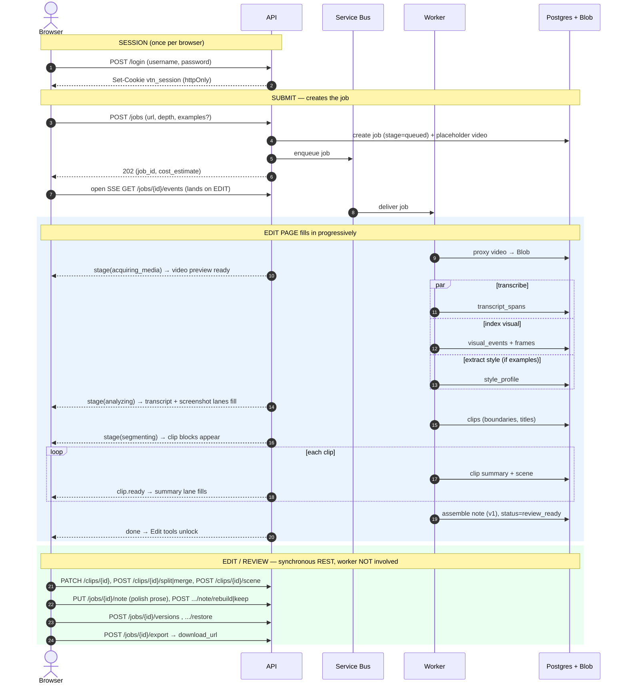
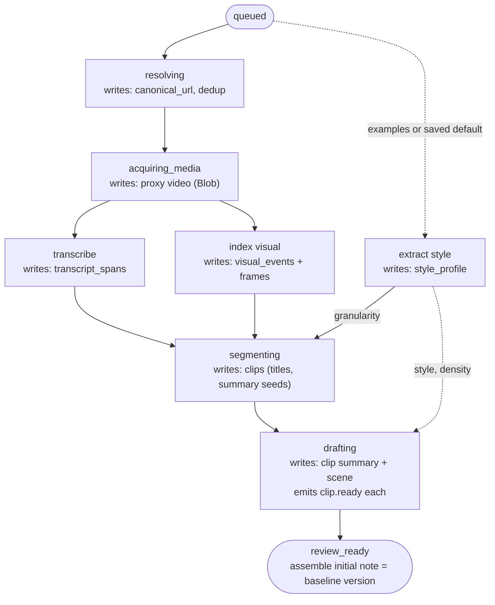

# Video-to-Note — Design

> Status: detailed / implementation-ready. This document is self-contained: it fully
> specifies the system without reference to any prior design.

## Table of contents

- [Overview](#overview)
- [Goals](#goals)
- [Non-goals](#non-goals)
- [Decided defaults](#decided-defaults)
- [Architecture](#architecture)
- [Repository structure](#repository-structure)
- [Domain model and job lifecycle](#domain-model-and-job-lifecycle)
- [Pipeline stages (overview)](#pipeline-stages-overview)
- [Data model (PostgreSQL)](#data-model-postgresql)
- [Pipeline (detailed algorithms)](#pipeline-detailed-algorithms)
- [Frontend](#frontend)
- [Edit ↔ Review reconciliation and versioning](#edit--review-reconciliation-and-versioning)
- [API contract](#api-contract)
- [Latency strategy](#latency-strategy)
- [Cost model](#cost-model)
- [Data retention](#data-retention)
- [Export format](#export-format)
- [Deployment and CI/CD](#deployment-and-cicd)
- [Security and configuration](#security-and-configuration)
- [Reliability and error handling](#reliability-and-error-handling)
- [Testing and evaluation](#testing-and-evaluation)
- [Open questions](#open-questions)

---

## Overview

Video-to-Note is a single-user, Azure-first web application that turns public conference
session videos into reviewed Markdown notes with screenshots. The target sources are YouTube
and Microsoft conference (Build / Ignite) session URLs. The output is a downloadable ZIP
containing a Markdown file and screenshot assets referenced by relative paths.

The product is optimized for a personal learning workflow. It drafts notes automatically, then
puts the human in control through two complementary editing surfaces before export:

- **Edit** — a timeline editor where the talk is divided into **clips**. The user adjusts clip
  boundaries (split / merge), picks each clip's screenshot ("scene"), and edits each clip's
  title and summary.
- **Review** — a document editor where the clips are **assembled into one continuous Markdown
  note** (heading, screenshot, prose, optional transcript quote per section) that the user can
  freely polish, version, and export.

A run starts immediately on submission and streams into the Edit page as it processes, so the
user can watch the talk take shape rather than waiting on a blank screen. The note can be
versioned, rebuilt from the clips, or restored to any earlier point without losing work.

## Goals

- Accept public YouTube and Microsoft conference session URLs.
- Generate Markdown notes with one relevant, de-duplicated screenshot per section.
- Support note depth choices: Thorough, Balanced, Brief, and a custom prompt.
- Process mixed session formats (slide talks, demos, Q&A, speaker changes) automatically,
  without asking the user to classify the session.
- Provide a timeline editor for adjusting clip boundaries and screenshots, and a document
  editor for polishing the assembled note, with durable version history.
- Stream processing results progressively to minimize perceived latency.
- Deploy as an Azure-first production-style application with frontend, backend, worker,
  infrastructure, CI/CD, observability, and secure configuration.
- Keep AI providers behind adapters so alternatives can be benchmarked and swapped when they
  materially improve quality (especially image/video/multimodal).

## Non-goals

- Multi-user workspaces, sharing, comments, or permissions.
- Fully unattended batch processing of many videos.
- Direct publishing to GitHub, OneDrive, SharePoint, or a team knowledge base.
- Real-time processing while a session is still live.
- Pixel-perfect note formatting for every downstream Markdown tool.

---

## Decided defaults

These choices are binding for this design:

| Area | Decision |
| --- | --- |
| Editing surfaces | **Two surfaces**: Edit (timeline / clips) and Review (assembled note). |
| Landing / progress | The **Edit page is the progress view**; lanes populate progressively via SSE. There is no separate progress screen. |
| Streaming transport | **Server-Sent Events (SSE)** for job progress and per-clip readiness. |
| Structural edit gating | Split / merge / set-scene are **disabled until drafting completes** (`review_ready`), so worker writes and user structural edits never overlap. |
| Per-clip content | **One summary** (the section prose) and **one screenshot** (the "scene") per clip. |
| Note representation | **Materialized artifact** — the note is stored Markdown, assembled from clips, independently editable, and may intentionally drift from the clips. |
| Reconciliation | When clips change after the note was polished: **Rebuild-or-Keep**, a whole-note binary choice; a version is saved either way. |
| Versioning | **Durable per-job history** of full project snapshots (note + clip structure + settings). The initial note is an immutable baseline. Restore rolls back note **and** clips together and is non-destructive. |
| Segmentation | **Hybrid** — uniform signal interface + config weights (recall), single LLM refinement pass (precision / labeling). |
| Media acquisition | **Download once** (yt-dlp), sample frames locally with ffmpeg; store a proxy copy in Blob. |
| Manual capture | **Backend frame-on-demand** — Review/Edit streams the stored proxy; "Set scene" calls ffmpeg to extract the exact frame at a timestamp. |
| Note generation granularity | **One LLM call per clip** (enables progressive streaming + per-clip regeneration). |
| Screenshot dedup | Perceptual hashing (pHash) to drop near-duplicate frames when picking a clip's scene. |
| Frontend | React + Next.js (App Router). |
| Backend / worker | Python; FastAPI for the API, shared packages for ingestion / media / AI / export. |
| Queue | Azure Service Bus with dead-letter queue. |
| Metadata store | Azure PostgreSQL Flexible Server. |
| Model access | Azure AI Foundry by default; provider adapters for benchmarking alternatives. |
| Embeddings | Azure OpenAI embedding deployment (via Foundry) for semantic-shift detection. |
| Auth | Single shared username/password (hash in Key Vault) → signed `httpOnly` session cookie; SSE authenticates via the cookie. |
| Cost policy | **Warn, never block** — estimate up front, show it, always proceed; record actuals. |
| Latency target | **Time-to-first-clip ≤ ~1–2 min** for a 1-hr captioned video; captions-first is the lever. |
| Queue abstraction | `QueueProvider` interface — Azure Service Bus in cloud, in-memory/SQLite queue locally. |
| Migrations | **Alembic**, versioned in repo; `alembic upgrade head` as a CD step. |
| Local dev | `docker-compose` (Postgres + Azurite) + a `fake` AI provider profile for offline, zero-spend runs. |
| Re-submit dedup | Reuse a video's proxy + transcript across jobs when the canonical URL was already processed; always create a new job. |
| Style examples | Optional per-job example notes (paste/upload `.md`), distilled once into a style profile; can be saved as the user's default. |

---

## Architecture

```text
                 ┌────────────┐        ┌──────────────────────┐
  Browser  ◄────►│  Frontend  │◄──SSE──│        API           │
 (Next.js)       │  (Next.js) │  REST  │   (FastAPI, ACA app) │
                 └────────────┘        └──────────┬───────────┘
                                                  │ enqueue job
                                                  ▼
                                        ┌──────────────────────┐
                                        │  Azure Service Bus    │
                                        │  (jobs + dead-letter) │
                                        └──────────┬───────────┘
                                                  │ trigger
                                                  ▼
                                        ┌──────────────────────┐
                                        │  Worker               │
                                        │ (ACA Job, Python)     │
                                        │  yt-dlp / ffmpeg /    │
                                        │  AI adapters          │
                                        └──┬───────────┬───────┘
                                           │           │
                          ┌────────────────┘           └───────────────┐
                          ▼                                            ▼
                 ┌──────────────────┐                       ┌─────────────────────┐
                 │ Azure Blob       │                       │ Azure PostgreSQL    │
                 │ (video proxy,    │                       │ (jobs, clips,       │
                 │  frames, exports)│                       │  notes, versions)   │
                 └──────────────────┘                       └─────────────────────┘

 Cross-cutting: Key Vault (secrets + shared credential hash + cookie-signing secret),
                Managed Identity (service-to-service auth), Application Insights (telemetry),
                Azure AI Foundry (models + embeddings), Azure AI Speech / Vision / Document Intelligence.
```

### Component responsibilities

- **Frontend (Next.js App Router)** — login, submit form, the Edit page (timeline editor that
  doubles as the progress view, SSE consumer), the Review page (document editor + version
  history), and the Export page.
- **API (FastAPI on Azure Container Apps)** — validates submissions, creates the job, enqueues
  work, exposes job/clip/note/version/export endpoints, relays progress via SSE, serves proxy
  range requests and frame-on-demand, assembles export ZIPs.
- **Worker (Azure Container Apps Job, Python)** — the processing pipeline. Consumes a Service
  Bus message, runs stages, writes artifacts to Blob and rows to PostgreSQL, and emits progress
  events the API forwards over SSE.
- **Service Bus** — decouples API from worker; provides retry + dead-letter.
- **Blob Storage** — video proxy, extracted frames/screenshots, export ZIPs, raw example notes.
- **PostgreSQL** — relational, timeline-ordered metadata, note, and version history.

### Progress event transport

The worker cannot hold the browser's HTTP connection, so progress flows:

`worker → progress channel → API SSE endpoint → browser`.

The progress channel is an append-only PostgreSQL table (`job_events`) plus PostgreSQL
`LISTEN/NOTIFY`. The API's SSE endpoint `LISTEN`s on a per-job channel and streams new
`job_events` rows; clients reconnect with `Last-Event-ID` to replay missed events. (If NOTIFY
proves limiting, Azure Web PubSub can sit behind the same SSE-facing API.)

### Frontend ↔ backend flow

The user-facing flow is **login → submit → edit → review → export**.

**Diagram 1 — frontend ↔ backend sequence:**



**Diagram 2 — worker pipeline internals:**



`acquiring_media` fans out to `transcribe` + `index visual`, which join at `segmenting`.
`extract style` branches from job submit (it needs only the supplied examples / saved default)
and feeds granularity into `segmenting` and style/density into `drafting`.

### Connection types

Every transport between tiers, and who never talks to whom:

| Transport | Direction | Used for |
| --- | --- | --- |
| One-shot REST | browser → API | login, submit (`POST /jobs`), export |
| SSE (push) | API → browser | job progress + per-clip readiness (`GET /jobs/{id}/events`) |
| Synchronous REST | browser ↔ API | all interactive editing (clips, note, versions) |
| Range / streaming | API → browser | proxy video scrubbing, scene image fetch |

The **browser never calls the worker**. Progress flows **up** from the worker as `job_events`
rows the API pushes over SSE; edits flow **across** via synchronous REST that never touches the
worker.

### User-facing flow → backend state

| Flow step | Backend state | Note |
| --- | --- | --- |
| login | none | session cookie only; not a job state |
| submit | `status=active`, `stage` `queued`→`drafting` | one `POST /jobs` starts the worker |
| edit | `status=review_ready` | the timeline is shown earlier (progressively), but editing tools unlock only here |
| review | `status=review_ready` | the **same** state as edit — two UI surfaces over one state, reconciled by the flags in [reconciliation](#edit--review-reconciliation-and-versioning) |
| export | `status=exported` | `POST /jobs/{id}/export`, repeatable |

### Event contract (SSE)

Each `job_events` row surfaces as one SSE event. Types, when emitted, and how the Edit page
reacts:

| Event `type` | Emitted when | Payload | Frontend reaction |
| --- | --- | --- | --- |
| `stage` | a stage is entered | `{stage}` | advance the "preparing" indicator; reveal the lane that stage feeds |
| `cost.estimate` | `resolving` refines the estimate | `{usd, breakdown}` | update the cost banner |
| `style.resolved` | `extract style` finishes | `{profile}` | show which dimensions came from examples vs depth |
| `clip.ready` | a clip's summary + scene are written | `{clip_id, order_index}` | fill that clip's summary-lane skeleton |
| `warning` | non-blocking degradation | `{code, message}` | inline notice (e.g. "ASR fallback") |
| `error` | a stage fails | `{code, message, stage}` | show failure + offer retry |
| `done` | `status` becomes `review_ready` | `{}` | unlock Edit tools (the initial note is already assembled server-side) |

During the parallel `analyzing` fork each branch emits its own `stage` event
(`transcribe` / `index visual` / `extract style`) while `jobs.stage` stays at `analyzing`
(see [the parallel fork](#domain-model-and-job-lifecycle)). The lane-readiness table in
[Editing is gated until `review_ready`](#editing-is-gated-until-review_ready) is the loading-state
view of these same events.

---

## Repository structure

```text
video-to-note/
├─ apps/
│  ├─ web/                      # Next.js frontend
│  │  ├─ app/                   # App Router routes: login, submit, edit, review, export
│  │  ├─ components/            # timeline, inspector, doc editor, version history
│  │  ├─ lib/                   # api client, SSE client, markdown<->html, types
│  │  └─ ...
│  └─ api/                      # FastAPI service
│     ├─ vtn_api/
│     │  ├─ main.py
│     │  ├─ routes/             # jobs, clips, note, versions, media, export
│     │  ├─ sse.py
│     │  └─ deps.py
│     └─ pyproject.toml
├─ worker/                      # ACA Job entrypoint
│  ├─ vtn_worker/
│  │  ├─ main.py                # service bus consumer + stage runner
│  │  └─ stages/
│  └─ pyproject.toml
├─ packages/                    # shared Python libraries
│  ├─ vtn_core/                 # domain models, job state machine, settings
│  ├─ vtn_ingest/               # url resolvers, media acquisition
│  ├─ vtn_transcript/           # transcript providers (captions, speech)
│  ├─ vtn_visual/               # frame sampling, change/OCR/keyframe detectors
│  ├─ vtn_style/                # style_profile type, example extraction, depth-merge resolution
│  ├─ vtn_segment/              # signal interface, fusion, LLM refinement
│  ├─ vtn_notes/                # clip summaries, scene selection, note assembly
│  ├─ vtn_export/               # markdown + ZIP assembly
│  ├─ vtn_storage/              # blob + postgres repositories, QueueProvider
│  └─ vtn_ai/                   # provider adapters (Foundry, Speech, Vision, embeddings) + `fake` profile
├─ migrations/                  # Alembic env + versioned revisions
├─ fixtures/                    # canned transcript/visual/LLM outputs for the `fake` profile + tests
├─ infra/                       # Bicep modules + azure.yaml (azd)
├─ docker-compose.yml           # local Postgres + Azurite
├─ .github/workflows/           # CI/CD
└─ docs/
```

Module boundaries map to pipeline stages so each stage is independently testable. The worker
orchestrates packages; packages never import the worker. `vtn_style` is a shared lower-level
package depended on by `vtn_segment` (granularity) and `vtn_notes` (style/density) — never the
reverse. `vtn_notes` owns both the per-clip drafting and the note-assembly logic.

---

## Domain model and job lifecycle

A **job** is one processing run for one **video** with one set of **prompt settings**. It owns
an ordered list of **clips**, exactly one assembled **note**, and a durable list of **note
versions**.

### Terminology

Defined once and used the same way in prose and diagrams:

| Term | Meaning |
| --- | --- |
| **stage** | A node of the pipeline state machine, recorded in `jobs.stage` (`queued`, `resolving`, `acquiring_media`, `analyzing`, `segmenting`, `drafting`). The unit the worker advances through. |
| **step** | A numbered sub-unit *inside* a stage — the algorithms in [Pipeline (detailed algorithms)](#pipeline-detailed-algorithms). A stage contains one or more steps. |
| **status** | The job lifecycle value in `jobs.status` (`active`, `review_ready`, `exported`, `failed`, `canceled`). `stage` advances only while `status='active'`. |
| **clip** | One timeline block: a contiguous time range with a title, one summary, and one scene. The unit the Edit page manipulates. |
| **scene** | The single screenshot chosen for a clip (the frame at `scene_at_sec`). |
| **summary seed** | The one-line gist written per clip at `segmenting` (`clips.summary_seed`); feeds the cross-clip outline. Distinct from the full `summary` written at `drafting`. |
| **note** | The single materialized Markdown document assembled from the clips; the unit the Review page edits and export serializes. |
| **version** | An immutable full-project snapshot (note + clip structure + settings) in history; `seq` is its user-visible number (v1, v2, …). |
| **drift** | The allowed state where the note no longer matches the clips (after "Keep my note"). Tracked by `notes.clips_dirty`. |

Stage → steps → owning package:

| Stage (`jobs.stage`) | Steps (detailed algorithms) | Package |
| --- | --- | --- |
| `resolving` | 1 | `vtn_ingest` |
| `acquiring_media` | 2 | `vtn_ingest` |
| `analyzing` (parallel) | 3 transcribe · 4 index visual · 4b extract style | `vtn_transcript` / `vtn_visual` / `vtn_style` |
| `segmenting` | 5 boundary signals · 6 fusion + refinement | `vtn_segment` |
| `drafting` | 7 scene selection · 8 clip summary | `vtn_notes` |

`review_ready` and `exported` are **statuses, not stages**: entering `review_ready` runs step 9
(initial note assembly) and entering `exported` runs export assembly — neither advances
`jobs.stage`.

### Job state machine

```text
queued
  → resolving        (resolve + validate URL, fetch metadata)
  → acquiring_media  (download proxy video)
  → analyzing        (transcribe + index visual + extract style, concurrently)
  → segmenting       (signal detection → fusion → LLM refinement → clips)
  → drafting         (per-clip summary + scene, emitted progressively)
       ↑ jobs.stage advances through the values above (only while status='active')

  ── then jobs.status advances; jobs.stage stays at its last value ──
  → review_ready     (all clips drafted; initial note assembled; editing unlocked)
  → exported         (ZIP produced)

Side states (jobs.status):
  failed             (stage recorded; resumable)
  canceled
```

`jobs.stage` tracks pipeline progress; `jobs.status` holds the lifecycle state (`active`, then
one of `review_ready` / `exported` / `failed` / `canceled`). While the worker runs,
`status='active'` and `stage` advances. On completion, `stage` stays at its last value and
`status` becomes `review_ready`.

**The parallel `analyzing` fork.** `transcribe`, `index visual`, and `extract style` run
concurrently and all depend only on earlier outputs (the proxy, or — for style — the supplied
examples). Because a scalar `jobs.stage` cannot name three concurrent branches, the **stage
orchestrator is the sole writer of `jobs.stage`**: it sets `analyzing` on entering the fork and
`segmenting` on join. The branches never write `jobs.stage`; they emit their own per-branch
events into `job_events` (authoritative for fine-grained progress) and write their artifacts.

### Editing is gated until `review_ready`

The Edit page is shown immediately after submit and fills in progressively as stages complete,
but **structural and content editing tools stay disabled until `review_ready`**. Concretely:

| Edit page element | Becomes usable when | Until then |
| --- | --- | --- |
| Video preview / scrub | `acquiring_media` done (proxy exists) | "preparing video" |
| Transcript lane | `analyzing` → transcribe done | transcript rows blank |
| Screenshot track | `analyzing` → index visual done | placeholder thumbnails |
| Clip blocks + boundaries | `segmenting` done | timeline empty |
| Summary / notes lane | `drafting` (per clip) | clip skeleton → fills in |
| Split / Merge / Set scene, clip edits | `review_ready` (drafting complete) | disabled |

Because all clip mutation happens strictly after the worker finishes writing clips, worker
writes and user edits never overlap — there is no concurrent-edit lock and no boundary
reindex race.

**Gating is "the worker has finished", not "status equals `review_ready`".** The unlock predicate
is *`review_ready` has been reached* — i.e. `status ∈ {review_ready, exported}`. Exporting does
**not** freeze the project: `status='exported'` is a repeatable marker that an export was produced,
not a lock. The user may keep editing clips and prose after an export; a subsequent export simply
re-assembles the ZIP from the (now-edited) current state. Editing endpoints therefore accept both
`review_ready` and `exported`, and only `active` (worker still running) returns
`job_not_review_ready`. There is no transition that sends an `exported` job back to `active`; the
worker never runs again for that job.

### Idempotency and resumability

- Every stage writes its output to Blob/PostgreSQL with a deterministic key derived from
  `job_id` + stage. Re-running a stage overwrites only its own outputs.
- The stage runner checks for an existing valid artifact before doing work (skip-if-present),
  enabling cheap resume after transient failures.
- Service Bus messages carry `job_id` + `attempt`; the worker is safe to receive duplicates.

---

## Pipeline stages (overview)

This section says *what each stage does and why*; the precise algorithms (the **steps**) are in
[Pipeline (detailed algorithms)](#pipeline-detailed-algorithms). Each heading is a stage from the
[state machine](#job-state-machine).

### `resolving` (`vtn_ingest`)

Turn a submitted URL into a validated, canonical source. A registry of `SourceResolver`
adapters (`YouTubeResolver`, `MicrosoftEventResolver`, `GenericResolver` fallback) answers
`can_handle(url)`; the first match runs `resolve(url)` to produce the canonical URL, source
type, title, duration, and media locator. The stage validates the video is public and reachable
(else `unsupported_url` / `video_unavailable`). **Re-submit dedup**: if a video with this
canonical URL already has a proxy + transcript, the worker re-points the job at it and the
media/transcript stages skip-if-present. When two jobs for the same canonical URL race before the
artifacts exist, a per-artifact video-level claim ensures exactly one worker populates each shared
artifact (see [Shared video artifact concurrency](#shared-video-artifact-concurrency)).

### `acquiring_media` (`vtn_ingest`)

Download a single **proxy** via yt-dlp at a capped resolution (default 720p) to bound
storage/egress while keeping screenshots legible, stored at `videos.proxy_blob_path`. The proxy
is the single source of truth: automated frame sampling, review scrubbing, and manual scene
capture all read the same pixels, keeping transcript timestamps and frame timestamps on one
clock.

### `analyzing` — transcribe (`vtn_transcript`)

A priority chain of `TranscriptProvider`s, best-quality first: source captions → platform
captions → Azure AI Speech ASR (from the proxy audio). The first success wins; output is
normalized to `transcript_spans` (start/end seconds, text, speaker where available). The chosen
`source` is recorded; falling back to ASR raises a non-blocking warning.

### `analyzing` — index visual (`vtn_visual`)

Extract a timeline of `visual_events` from the frames. Two-tier ffmpeg sampling for latency: a
coarse pass (~1 fps) finds change regions, then a fine pass samples densely only around them.
Cheap detectors each emit a `visual_event`:

- **Slide/scene change** — pixel difference / SSIM jump between consecutive frames.
- **Title/OCR change** — OCR (Azure Vision / Document Intelligence) on candidate frames; the
  extracted text is stored (`ocr_text`) and reused as evidence + caption material.
- **Keyframe candidate** — the settled, representative frame within a shot.
- **Demo/visual-dense** — sustained high local change rate (typing, scrolling code, animation).
- **Low-speech/high-visual-change** — visual motion in transcript-sparse windows.

A perceptual hash (`phash`) is computed per stored frame for later dedup. This is classic CV +
targeted OCR — no embeddings or vector store. The events are both boundary hints for
`segmenting` and the candidate pool for each clip's scene in `drafting`.

### `analyzing` — extract style (`vtn_style`), only when examples are provided

If the job supplies example Markdown (pasted or uploaded `.md`, or a saved default), a one-time
LLM extraction distills, per dimension with a confidence: a `style_descriptor` (headings,
prose-vs-bullets, code-block usage, caption style, voice), a `granularity` target (coarse →
fine), a `density` target (note length + scene prominence), and a `derived_prompt`. A
deterministic resolution step merges these with the `depth` preset per dimension (a
confidently-inferred example dimension wins; otherwise `depth` fills in) and persists the result
to `prompts.style_profile`, emitting a `style.resolved` event. Resolution runs for every job, so
`style_profile` is always populated before `segmenting`; with no examples it yields a depth-only
profile. Examples are a style/format reference only — never a source of facts.

### `segmenting` (`vtn_segment`)

Fuse transcript + visual signals into ordered clip boundaries with titles, summary seeds, and
classifications. Every signal source implements one `BoundaryDetector` interface emitting
`BoundaryCandidate`s. Deterministic fusion favors recall (cluster nearby candidates, score by
configurable per-signal weights, keep above a threshold, snap boundaries to transcript-span
starts / slide frames). A single LLM refinement pass adds precision + labeling: it merges
over-segmentation, drops spurious boundaries, writes each clip's title, a one-line summary seed,
and a `text_led | visual_led | mixed` class, collapsed to the profile's granularity.

### `drafting` (`vtn_notes`)

For each clip (bounded concurrency), choose its **scene** and write its **summary**, streaming
each out as it finishes:

- **Scene selection** — score the clip's `visual_events` by type × confidence (boosting
  slide/title/demo frames), dedup near-identical frames via `phash` Hamming distance, pick the
  best one, and materialize that frame as the clip's screenshot.
- **Summary** — one LLM call fed the clip transcript, visual/OCR summary, the chosen scene, the
  resolved `style_profile`, and the **global outline** (every clip's title + summary seed) for
  cross-clip continuity and non-redundancy. Each finished clip writes its `summary` + scene and
  publishes a `clip.ready` event.

### `review_ready` (status — `vtn_notes` assembles the note)

All clips drafted. The worker **assembles the initial note** from the clips (in `order_index`
order: title + scene + summary, transcript excluded by default), writes the `notes` row, and
freezes the **immutable baseline version** (`seq=1`, "Initial note"). Editing tools unlock.

### `exported` (status — `vtn_export`)

Assemble a ZIP from current state: `note.md` with relative image paths, an `images/` folder
(one scene per clip), and a `metadata.json` capturing source URL, depth, transcript source, and
per-clip + per-scene timestamps for audit and re-import.

---

## Data model (PostgreSQL)

Types are PostgreSQL. `id` columns are `uuid` (default `gen_random_uuid()`). Timestamps are
`timestamptz`. Time offsets within a video are `numeric(10,3)` seconds.

```sql
-- A submitted source video. At most one non-placeholder row per canonical URL.
CREATE TABLE videos (
  id              uuid PRIMARY KEY DEFAULT gen_random_uuid(),
  source_url      text NOT NULL,
  canonical_url   text,
  source_type     text NOT NULL,         -- 'youtube' | 'msbuild' | 'msignite' | 'other'
  title           text,
  duration_sec    numeric(10,3),
  proxy_blob_path text,                  -- stored video proxy for sampling + scrubbing
  -- Per-artifact build state. Each shared artifact is populated by exactly one worker; others
  -- wait for 'ready' or re-claim from 'absent'. See "Shared video artifact concurrency".
  proxy_state      text NOT NULL DEFAULT 'absent',  -- 'absent' | 'building' | 'ready'
  transcript_state text NOT NULL DEFAULT 'absent',  -- 'absent' | 'building' | 'ready'
  visual_state     text NOT NULL DEFAULT 'absent',  -- 'absent' | 'building' | 'ready'
  proxy_owner_job      uuid,             -- job that claimed the 'building' transition (audit/recovery)
  transcript_owner_job uuid,
  visual_owner_job     uuid,
  artifacts_updated_at timestamptz NOT NULL DEFAULT now(),
  created_at      timestamptz NOT NULL DEFAULT now()
);
CREATE UNIQUE INDEX uq_videos_canonical ON videos(canonical_url) WHERE canonical_url IS NOT NULL;

-- One processing run.
CREATE TABLE jobs (
  id            uuid PRIMARY KEY DEFAULT gen_random_uuid(),
  video_id      uuid NOT NULL REFERENCES videos(id) ON DELETE CASCADE,
  stage         text NOT NULL DEFAULT 'queued'
                  CHECK (stage IN ('queued','resolving','acquiring_media','analyzing','segmenting','drafting')),
  status        text NOT NULL DEFAULT 'active'
                  CHECK (status IN ('active','failed','review_ready','exported','canceled')),
  error_code    text,
  error_message text,
  attempt       int  NOT NULL DEFAULT 0,
  created_at    timestamptz NOT NULL DEFAULT now(),
  updated_at    timestamptz NOT NULL DEFAULT now()
);
CREATE INDEX idx_jobs_video ON jobs(video_id);

-- Note settings captured at submission time.
CREATE TABLE prompts (
  job_id        uuid PRIMARY KEY REFERENCES jobs(id) ON DELETE CASCADE,
  depth         text NOT NULL,           -- 'thorough' | 'balanced' | 'brief' | 'custom'
  custom_prompt text,                    -- non-null only when depth='custom'
  examples      jsonb NOT NULL DEFAULT '[]',  -- manifest: [{name, blob_path}] of supplied example notes
  style_profile jsonb NOT NULL DEFAULT '{}',  -- resolved profile; '{}' until extract-style runs
  save_style_as_default boolean NOT NULL DEFAULT false,
  model_config  jsonb NOT NULL DEFAULT '{}'   -- externalized model ids/params
);

-- Singleton holding the user's saved default style.
CREATE TABLE style_defaults (
  id            boolean PRIMARY KEY DEFAULT true CHECK (id),  -- enforces a single row
  examples      jsonb NOT NULL DEFAULT '[]',
  extracted     jsonb NOT NULL DEFAULT '{}',  -- example-derived dimensions + confidences (pre-resolution)
  updated_at    timestamptz NOT NULL DEFAULT now()
);

-- Normalized transcript spans on the video timeline.
CREATE TABLE transcript_spans (
  id          uuid PRIMARY KEY DEFAULT gen_random_uuid(),
  video_id    uuid NOT NULL REFERENCES videos(id) ON DELETE CASCADE,
  start_sec   numeric(10,3) NOT NULL,
  end_sec     numeric(10,3) NOT NULL,
  text        text NOT NULL,
  speaker     text,
  source      text NOT NULL              -- 'source_captions' | 'youtube_captions' | 'azure_speech'
);
CREATE INDEX idx_spans_video_time ON transcript_spans(video_id, start_sec);
-- One transcript row set per (video, start) — the owner does delete-before-insert per video_id
-- inside its 'building' transaction; the unique key rejects any concurrent double-write.
CREATE UNIQUE INDEX uq_spans_video_start ON transcript_spans(video_id, start_sec);

-- Visual events detected from sampled frames (boundary hints + scene candidates).
CREATE TABLE visual_events (
  id          uuid PRIMARY KEY DEFAULT gen_random_uuid(),
  video_id    uuid NOT NULL REFERENCES videos(id) ON DELETE CASCADE,
  at_sec      numeric(10,3) NOT NULL,
  event_type  text NOT NULL,            -- 'slide_change'|'title_change'|'keyframe'|'demo_change'|'low_speech_visual'
  confidence  real NOT NULL,
  ocr_text    text,
  phash       text,                     -- perceptual hash for dedup
  frame_blob_path text
);
CREATE INDEX idx_visual_video_time ON visual_events(video_id, at_sec);
-- One visual-event row per (video, timestamp, type); owner does delete-before-insert per video_id
-- inside its 'building' transaction, so concurrent jobs can never duplicate the event set.
CREATE UNIQUE INDEX uq_visual_video_at_type ON visual_events(video_id, at_sec, event_type);

-- A clip = one timeline block. One summary and one scene per clip.
CREATE TABLE clips (
  id              uuid PRIMARY KEY DEFAULT gen_random_uuid(),
  job_id          uuid NOT NULL REFERENCES jobs(id) ON DELETE CASCADE,
  order_index     int  NOT NULL,
  start_sec       numeric(10,3) NOT NULL,
  end_sec         numeric(10,3) NOT NULL,
  title           text,
  summary_seed    text,                   -- one-line gist from segmenting; feeds the cross-clip outline
  summary         text,                   -- the generated prose (drafting); also the section prose source
  ai_summary      text,                   -- last AI version (for "Restore AI summary"); null until edited
  classification  text CHECK (classification IN ('text_led','visual_led','mixed')),
  confidence      real,
  status          text NOT NULL DEFAULT 'pending' CHECK (status IN ('pending','ready')), -- 'pending' (segmented) | 'ready' (drafted)
  scene_at_sec    numeric(10,3),          -- timestamp of the chosen screenshot frame
  scene_blob_path text,                   -- materialized frame
  scene_caption   text,                   -- authoritative owner of the editable caption; assembled into notes.markdown, never edited there
  scene_source    text NOT NULL DEFAULT 'auto' CHECK (scene_source IN ('auto','manual')),
  needs_regen     boolean NOT NULL DEFAULT false, -- set when boundaries change (the "flagged" state)
  updated_at      timestamptz NOT NULL DEFAULT now(),
  UNIQUE (job_id, order_index)
);
CREATE INDEX idx_clips_job ON clips(job_id, order_index);

-- The materialized assembled note. Exactly one current note per job.
CREATE TABLE notes (
  job_id             uuid PRIMARY KEY REFERENCES jobs(id) ON DELETE CASCADE,
  markdown           text NOT NULL,        -- canonical prose; NEVER contains transcript blocks
  include_summary    boolean NOT NULL DEFAULT true,  -- render/export flag only; whether the prose is emitted (stays stored regardless)
  include_transcript boolean NOT NULL DEFAULT false, -- render/export flag only; transcript composited from transcript_spans, not stored here
  is_polished        boolean NOT NULL DEFAULT false, -- user hand-edited prose since last assemble/rebuild
  clips_dirty        boolean NOT NULL DEFAULT false, -- clips changed since note last built/kept (drift)
  CONSTRAINT note_content_nonempty CHECK (include_summary OR include_transcript), -- at least one content kind
  built_from_version int,                  -- advisory provenance only (nullable): note_versions.seq the
                                           -- current note was last assembled/rebuilt/restored from. Set by
                                           -- initial assembly, rebuild, and restore; NOT a concurrency guard
                                           -- (that is the note ETag) and not read by any gating logic — it
                                           -- exists for history display ("built from v{n}") and debugging.
  updated_at         timestamptz NOT NULL DEFAULT now()
);

-- Durable, per-job version history. Full project snapshots. Non-destructive.
CREATE TABLE note_versions (
  id              uuid PRIMARY KEY DEFAULT gen_random_uuid(),
  job_id          uuid NOT NULL REFERENCES jobs(id) ON DELETE CASCADE,
  seq             int  NOT NULL,           -- the v1, v2, v3… counter (per job)
  label           text NOT NULL,
  kind            text NOT NULL CHECK (kind IN ('initial','auto_edit','auto_pre_change','auto_rebuild','manual','restore')),
  is_baseline     boolean NOT NULL DEFAULT false,  -- true only for seq=1; immutable, never pruned
  note_markdown   text NOT NULL,
  note_settings   jsonb NOT NULL DEFAULT '{}',  -- {include_summary, include_transcript, is_polished} restored verbatim; excludes clips_dirty (a note↔clips relationship, recomputed to false on restore)
  clips_snapshot  jsonb NOT NULL,          -- full clip structure at snapshot time
  created_at      timestamptz NOT NULL DEFAULT now(),
  UNIQUE (job_id, seq)
);
CREATE INDEX idx_versions_job ON note_versions(job_id, seq DESC);

-- Append-only progress/event log; drives SSE via LISTEN/NOTIFY.
CREATE TABLE job_events (
  id         bigserial PRIMARY KEY,
  job_id     uuid NOT NULL REFERENCES jobs(id) ON DELETE CASCADE,
  type       text NOT NULL,            -- 'stage'|'cost.estimate'|'style.resolved'|'clip.ready'|'warning'|'error'|'done'
  payload    jsonb NOT NULL,
  created_at timestamptz NOT NULL DEFAULT now()
);
CREATE INDEX idx_events_job ON job_events(job_id, id);

-- Export records.
CREATE TABLE exports (
  id          uuid PRIMARY KEY DEFAULT gen_random_uuid(),
  job_id      uuid NOT NULL REFERENCES jobs(id) ON DELETE CASCADE,
  zip_blob_path text NOT NULL,
  created_at  timestamptz NOT NULL DEFAULT now()
);

-- Cost estimate (at submit) and actuals (after run) per job. Warn-only.
CREATE TABLE job_costs (
  job_id        uuid PRIMARY KEY REFERENCES jobs(id) ON DELETE CASCADE,
  estimate_usd  numeric(10,4),
  estimate_json jsonb NOT NULL DEFAULT '{}',
  actual_usd    numeric(10,4),
  actual_json   jsonb NOT NULL DEFAULT '{}',
  computed_at   timestamptz
);
```

`prompts.style_profile` is the resolved detail profile:

```json
{
  "style_descriptor": "distilled style guide (headings, prose-vs-bullets, code, captions, voice)",
  "granularity":    { "value": "coarse|medium|fine", "confidence": 0.0, "source": "examples|depth" },
  "density":        { "value": "low|medium|high",     "confidence": 0.0, "source": "examples|depth" },
  "derived_prompt": "instruction inferred from examples, merged with custom_prompt",
  "extracted_from": [ { "name": "example1.md", "blob_path": "examples/<job>/example1.md" } ]
}
```

Raw example Markdown lives in the `examples` Blob container; the row holds only the manifest.

---

## Pipeline (detailed algorithms)

The numbered **steps** below are the sub-units of the stages in
[Pipeline stages (overview)](#pipeline-stages-overview) (see [Terminology](#terminology)). Steps
1–2 are single-step stages; steps 3 / 4 / 4b are the parallel `analyzing` branches; steps 5–6 are
`segmenting`; steps 7–8 are `drafting`; step 9 runs on entering `review_ready`.

### 1. URL resolution & ingestion (`vtn_ingest`)

- A registry of `SourceResolver` adapters, each exposing `can_handle(url) -> bool` and
  `resolve(url) -> ResolvedSource{canonical_url, source_type, title, duration, caption_tracks,
  media_locator}`. Adapters: `YouTubeResolver`, `MicrosoftEventResolver`, `GenericResolver`.
- Validates the video is public and reachable; otherwise fails with `unsupported_url` /
  `video_unavailable`.
- **Re-submit dedup**: the API creates a placeholder `videos` row at submit (keyed on
  `source_url`, `canonical_url` null). After this stage resolves `canonical_url`, the worker
  claims the canonical row atomically: under one transaction it takes
  `pg_advisory_xact_lock(hashtext(canonical_url))`, then `INSERT ... ON CONFLICT (canonical_url)
  DO NOTHING`. If a canonical row already exists it re-points `job.video_id` and deletes the
  placeholder; otherwise it promotes its own placeholder. After this, all jobs for the URL share
  one `videos` row, and the per-artifact claim in
  [Shared video artifact concurrency](#shared-video-artifact-concurrency) — not "who downloads" —
  decides which single worker populates each shared artifact.

### 1a. Shared video artifact concurrency

Re-submit dedup re-points many jobs at one `videos` row, and `transcript_spans` / `visual_events`
/ the proxy are keyed by `video_id`. So two jobs for the same canonical URL can reach
`acquiring_media` / `analyzing` concurrently. Determinism by `job_id + stage` is **not** enough
for these *video-scoped* artifacts; they need a **video-level claim**. Contract:

- Each shared artifact has a state column on `videos` (`proxy_state`, `transcript_state`,
  `visual_state`), each `absent → building → ready`.
- A worker **claims** an artifact with a single atomic compare-and-set:

  ```sql
  UPDATE videos
     SET proxy_state='building', proxy_owner_job=:job, artifacts_updated_at=now()
   WHERE id=:video_id AND proxy_state='absent'
  RETURNING id;   -- non-empty ⇒ this worker won the claim
  ```

  Exactly one worker can win (`absent` is the guard); the CAS is the lock, so no long-held
  transaction is needed across the multi-minute download/transcribe.
- **Winner** builds the artifact, then within one transaction does **delete-before-insert** of
  the artifact's rows by `video_id` (for `transcript_spans` / `visual_events`) — or writes
  `proxy_blob_path` — and sets the state to `ready`. The `uq_spans_video_start` /
  `uq_visual_video_at_type` unique indexes make any accidental concurrent insert fail loudly
  rather than duplicate.
- **Losers** (CAS returned empty) **wait**: poll the state (or `LISTEN` on a per-video channel)
  until it is `ready`, then skip-if-present and read the shared rows. They never write the shared
  artifact.
- **Failure / recovery**: a winner that fails resets its artifact `state` back to `absent` (and
  clears the owner) as part of the job's failure handling, so a retry or a sibling job can
  re-claim. A stale `building` older than a timeout (worker crash) is reclaimable: a CAS
  `WHERE state='building' AND artifacts_updated_at < now() - :stale_timeout` lets one waiter take
  over. Because the winner's write is delete-before-insert under the unique index, takeover is
  safe even if the crashed worker had written partial rows.

This makes proxy, transcript, and visual artifacts **single-writer per canonical video** while
clip/note/version state stays job-scoped. The per-`job_id`+stage idempotency in
[Idempotency and resumability](#idempotency-and-resumability) still governs *job-scoped* outputs
(clips, note, scenes); this section governs the *video-scoped* shared ones.

### 2. Media acquisition (`vtn_ingest`)

- **Claim** the proxy via the `proxy_state` CAS
  ([Shared video artifact concurrency](#shared-video-artifact-concurrency)). Only the winner
  downloads; losers wait for `proxy_state='ready'` and skip-if-present.
- Download a single proxy via yt-dlp (or the source media URL) at a capped resolution (default
  720p). Store as `videos.proxy_blob_path`, then set `proxy_state='ready'`. Skip-if-present for
  resume.
- The proxy is the single source of truth for automated sampling and review scrubbing / manual
  scene capture (same pixels everywhere).

### 3. Transcript acquisition (`vtn_transcript`)

Priority chain, each behind a `TranscriptProvider`:
1. `SourceCaptionsProvider` — official captions/transcript from the source page.
2. `YouTubeCaptionsProvider` — YouTube captions.
3. `AzureSpeechProvider` — Azure AI Speech transcription from the proxy audio.

Guarded by the `transcript_state` CAS
([Shared video artifact concurrency](#shared-video-artifact-concurrency)): the winner runs the
chain and, in one transaction, deletes existing `transcript_spans` for the `video_id` and inserts
the new set, then sets `transcript_state='ready'`; losers wait and read. Output normalized to
`transcript_spans`. The chosen `source` is recorded and surfaced in the UI (no silent quality
downgrade).

### 4. Visual-event indexing (`vtn_visual`)

- Sample frames with ffmpeg. Two-tier sampling: coarse pass (~1 fps) to find change regions,
  fine pass only around detected changes.
- Detectors (each emits `visual_events`): slide/scene change (frame diff / SSIM), title/OCR
  change (OCR on candidate frames → text-change), keyframe candidate, demo/visual-dense (high
  local change rate), low-speech/high-visual-change.
- Compute a `phash` per stored frame for later dedup.
- Guarded by the `visual_state` CAS
  ([Shared video artifact concurrency](#shared-video-artifact-concurrency)): the winner builds the
  events and, in one transaction, deletes existing `visual_events` for the `video_id` and inserts
  the new set, then sets `visual_state='ready'`; losers wait and read.

### 4b. Style extraction (`vtn_style`) — optional

1. **Extraction (LLM, cached).** Read the example Markdown and emit, per dimension with a
   confidence in 0..1: `style_descriptor`, `granularity`, `density`, `derived_prompt`. Runs only
   on new examples; cached on the job and (if `save_style_as_default`) upserted into
   `style_defaults.extracted`.
2. **Resolution (deterministic, every job).** Merge extracted (or default) dimensions with the
   `depth` preset per dimension: a confidently-inferred example dimension wins
   (`source='examples'`); otherwise the preset fills in (`source='depth'`). `depth` maps to
   defaults (Brief → coarse/low, Balanced → medium/medium, Thorough → fine/high; custom →
   medium/medium). Persist to `prompts.style_profile`.

A thin example yields low-confidence dimensions that fall back to `depth`. After resolution the
worker emits `style.resolved`; extraction is schema-validated, falling back to depth presets
with a warning on failure (never a hard failure).

### 5. Boundary signals — uniform interface (`vtn_segment`)

```python
class BoundaryDetector(Protocol):
    name: str
    def detect(self, ctx: TimelineContext) -> list[BoundaryCandidate]: ...

@dataclass
class BoundaryCandidate:
    at_sec: float
    signal_type: str      # 'semantic_shift'|'speaker_change'|'time_gap'
                          # |'slide_change'|'title_change'|'demo_change'
    strength: float       # 0..1
    evidence: dict        # detector-specific, for debugging/eval
```

`TimelineContext` exposes the aligned transcript spans + visual events. Detectors:
`SemanticShiftDetector` (embedding cosine drop between adjacent transcript windows, via the
Azure OpenAI embedding deployment), `SpeakerChangeDetector`, `TimeGapDetector`,
`SlideChangeDetector`, `TitleChangeDetector`, `DemoChangeDetector`. Adding a variation = register
one detector or tune a weight; never edit fusion.

**Alignment is a temporal interval-join.** Transcript timestamps and frame timestamps share one
clock (the same downloaded proxy). Building `TimelineContext`: slice the transcript into sliding
windows (~20–40s / N spans); for each window, attach the `visual_events` whose `at_sec` falls
inside it. When transcript comes from a separate source-caption file, verify its duration
matches the proxy; on detected drift, emit a warning (never silently misalign).

### 6. Fusion + LLM refinement (`vtn_segment`)

1. Collect all `BoundaryCandidate`s.
2. Cluster candidates within a `merge_window` (default 4s) into a combined boundary at the
   strength-weighted mean timestamp, carrying the set of contributing `signal_type`s.
3. Score each boundary: `score = Σ (weight[signal_type] * strength)`. Weights live in config
   (`segmentation.weights`), tunable from the eval harness.
4. Keep boundaries above `min_score` (favoring recall) → candidate clips.
5. **Snap** each surviving boundary to the nearest transcript-span start and, where close, the
   nearest `slide_change` frame, so cuts don't land mid-sentence and clips open on the
   introducing slide.
6. **LLM refinement pass** (single call). Input is a compact outline (per candidate clip:
   index, start/end, short excerpt, slide OCR text, contributing signal types, visual-event
   counts). The LLM may merge over-segmented neighbors, drop spurious boundaries, split a clip
   only at an anchor timestamp it was given, write a title and a one-line summary seed, and
   classify each as `text_led|visual_led|mixed`. It returns strict JSON keyed by input index.
   Given `style_profile.granularity`, it collapses to that level. Low temperature;
   schema-validated; on invalid JSON, one retry then fall back to unrefined boundaries with a
   warning. If the outline exceeds the token budget, chunk into contiguous ranges with overlap
   and stitch.
7. Persist `clips` in order (each with `status='pending'`, plus `title`, `summary_seed`, and
   `classification`; the full `summary` and `scene` are written later by `drafting`).

### 7. Scene selection (`vtn_notes`)

Per clip:
1. Gather `visual_events` within `[start_sec, end_sec]`.
2. Score by `event_type` weight × `confidence`, boosting slide/title/demo frames.
3. Deduplicate via `phash` Hamming distance.
4. Pick the single best frame; for `visual_led` clips prefer a slide/demo frame, for `text_led`
   prefer a representative keyframe. Default `scene_at_sec` ≈ a salient point of the clip.
5. Materialize the frame to Blob; store `scene_at_sec`, `scene_blob_path`, `scene_source='auto'`.
   The scene picker (Edit page) offers a few alternative candidate frames; "Set scene" replaces
   the scene with a frame-on-demand extraction at any timestamp.

### 8. Clip summary generation (`vtn_notes`) — one call per clip

- Optional whole-transcript cleanup pass first (fix ASR punctuation/casing) for `azure_speech`
  source; cached and reused per clip.
- For each clip, in `order_index` order with bounded concurrency, call the generator with: the
  clip transcript, small neighbor context, visual/OCR summary, the chosen scene, the resolved
  `style_profile` (style descriptor + density + merged derived/custom prompt), and the **global
  outline** (every clip's title + summary seed) so clips stay consistent and non-redundant.
- Write `clips.summary` (and set `clips.ai_summary` to the same value), set
  `clips.status='ready'`, publish `clip.ready`.

### 9. Initial note assembly (`vtn_notes`)

On entering `review_ready`, assemble `notes.markdown` from the clips in order. Each clip
contributes a section: `## {order}. {title}` with its time range, the scene image (relative
path) with `scene_caption`, and the `summary` prose. Write the `notes` row
(`include_summary=true`, `include_transcript=false`, `is_polished=false`, `clips_dirty=false`) and
freeze the baseline version (`seq=1`, `kind='initial'`, `is_baseline=true`).

**Both prose and transcript are render-time selections; the assembler always writes the full
prose into `notes.markdown`.** Two presentation flags on `notes` choose what the rendered/exported
document contains, neither of which is note content:

- **`include_summary`** (default `true`) — whether the `summary` prose is emitted. The prose is
  **always stored** in `notes.markdown` regardless, so excluding it is lossless and reversible:
  polish, rebuild, and versioning keep operating on the stored prose, and re-including it requires
  no regeneration.
- **`include_transcript`** (default `false`) — whether transcript blockquotes (composed virtually
  from each clip's `transcript_spans`) are inserted under each section.

The derived **content mode** is `summary` / `transcript` / `both`; **at least one flag must be
true** (enforced by `note_content_nonempty`). Every section always emits its heading + scene +
caption; the two flags select prose and/or transcript beneath it. **Transcript text is never
persisted in `notes.markdown`.** The assembler writes the same `notes.markdown` regardless of either
flag. This keeps one source of truth: prose lives in `notes.markdown`; transcript text lives in
`transcript_spans`; the flags only decide what is composited into the rendered/exported document.
See [Content selection is a render-time projection](#content-selection-is-a-render-time-projection).

---

## Frontend

Five routes under the Next.js App Router.

### Login

Single shared credential form → `POST /login` → signed `httpOnly` session cookie gates all other
routes.

### Submit

URL input; a depth chooser (Thorough / Balanced / Brief / "I'll prompt it" with a custom-prompt
field); an optional "Match my style" panel (use saved style, or add `.md` examples for this job,
with a "save as my default" toggle); a non-blocking cost estimate banner. Submitting calls
`POST /jobs` and navigates to the Edit page.

### Edit (timeline editor + progress view)

The landing surface after submit. A video preview stage (proxy at 720p) with transport
controls; a per-clip inspector; and a timeline with four lanes — **Screenshot**, **Clips**,
**Transcript**, **Summary/Notes**. While the pipeline runs, a "preparing" indicator shows and
lanes fill progressively per the readiness table in the lifecycle section. Once `review_ready`:

- **Split** at the playhead (transcript-anchored); both halves flag `needs_regen`.
- **Merge** consecutive selected clips; the result flags `needs_regen`.
- **Set scene** — set a clip's screenshot to the frame at the playhead (frame-on-demand); the
  inspector also offers a few candidate frames.
- Per-clip inspector edits **title** and **summary/notes** (with "Restore AI summary" backed by
  `ai_summary`). A clip flagged `needs_regen` offers a one-click **Regenerate** to refit its
  summary.

A "Continue to review" action moves to the Review page. If the note has been polished and the
user attempts a clip change, a heads-up modal appears (see reconciliation).

### Review (document editor + version history)

The assembled note rendered as an editable document: per section a heading + time range, the
scene figure with an editable caption (see [Caption editing](#caption-editing-is-a-clip-mutation)
— the caption is owned by the clip, not by `notes.markdown`), the editable prose (shown when
`include_summary` is on), and — when `include_transcript` is on — a **read-only** transcript
blockquote projected from the clip's `transcript_spans` (virtual; not part of the editable markdown,
see [Content selection is a render-time projection](#content-selection-is-a-render-time-projection)).
A Markdown toolbar (headings, bold/italic/inline-code, lists, quote, link, divider).

A **content selector** chooses what the note contains — **Summary**, **Transcript**, or **Both**
(default Summary) — backed by the `include_summary` / `include_transcript` flags; **at least one is
always selected** (the control disables deselecting the last one). The selector persists only the
booleans and re-renders without rewriting prose. The prose editor remains available even when
`include_summary` is off (the prose stays stored and editable, marked "excluded from output"), so
polish and versioning keep working and re-selecting Summary is lossless. A **version history**
popover with **Save version** and **Restore**, and a **rebuild banner** when clips changed.
**Proceed to export** moves on.

### Export

A summary card (filename, section/screenshot counts, size) and the ZIP contents (`note.md`,
`images/`, `metadata.json`). The download button calls `POST /jobs/{id}/export`. "Start a new
note" returns to Submit.

---

## Edit ↔ Review reconciliation and versioning

The note is a materialized artifact assembled from the clips. The Edit page mutates **clips**;
the Review page mutates the **note**. Two flags on `notes` reconcile them.

### Flags

- **`is_polished`** — set **true** when the user hand-edits prose in Review. Reset to **false**
  only by a **Rebuild** (the note again matches the clips). A "Keep my note" leaves it true.
- **`clips_dirty`** — set **true** when clips change (split / merge / set-scene / title /
  summary edit) **while `is_polished` is true**. Cleared by **Rebuild** or **Keep my note**.

### Clip mutations when the note is **not** polished (`is_polished=false`)

This is the common case (the user has not hand-edited prose, or has just rebuilt). Here the note
is still a faithful projection of the clips, so it must **never** be allowed to go stale:

> **Auto-sync rule.** Any clip mutation (split / merge / set-scene / title / summary edit /
> regenerate) performed while `is_polished=false` **synchronously re-assembles `notes.markdown`
> from the current clips in the same transaction as the clip write**, leaving both
> `is_polished=false` and `clips_dirty=false`. No acknowledgement, modal, dirty flag, or rebuild
> banner is involved.

The re-assembly reuses the same step-9 assembler ([Initial note assembly](#9-initial-note-assembly-vtn_notes))
so the note and clips can never diverge while unpolished. Because every clip mutation commits the
matching `notes.markdown` atomically, **export always reads a `notes.markdown` consistent with the
clips** unless the user has *deliberately* chosen to keep a polished, drifted note (`is_polished=true`,
the `clips_dirty` path below). There is no third state in which export can serve markdown that
silently lags the clips.

This makes the `needs_ack` / `clips_dirty` flow below an `is_polished=true`-only concern: the
acknowledgement modal and rebuild banner exist solely to protect *hand-edited* prose, never to
guard an unpolished note.

The two UI warnings are pure functions of the flags:
- Edit "Note will refresh" chip + heads-up modal ⇔ the user is about to change clips while
  `is_polished = true`.
- Review rebuild banner ⇔ `clips_dirty = true`.

### Post-split / post-merge clip values (before regeneration)

Split and merge change boundaries and set `needs_regen=true`, but the clip still needs concrete
field values so the auto-sync re-assembly (and export) always produces valid Markdown **without
waiting for regeneration**. The values are derived **deterministically** from the source clip(s) —
no LLM call — and are treated as placeholders that **Regenerate** later replaces:

| Field | Split → first half | Split → second half | Merge → combined clip |
| --- | --- | --- | --- |
| `title` | inherits source `title` | source `title` + " (cont.)" | first source clip's `title` |
| `summary` | inherits source `summary` (verbatim) | inherits source `summary` (verbatim) | source `summary`s concatenated in order, blank-line separated |
| `ai_summary` | inherits source `ai_summary` | inherits source `ai_summary` | first source clip's `ai_summary` (non-null) |
| `summary_seed` | inherits source `summary_seed` | inherits source `summary_seed` | first source clip's `summary_seed` |
| `scene_*` (`scene_at_sec`, `scene_blob_path`, `scene_caption`, `scene_source`) | inherited **iff** source `scene_at_sec` falls inside the first half's range; else frame-on-demand at the half's `start_sec` with `scene_source='auto'`, `scene_caption=null` | frame-on-demand at the second half's `start_sec`, `scene_source='auto'`, `scene_caption=null` | first source clip's `scene_*` (kept verbatim, including any manual caption) |
| `classification`, `confidence` | inherited from source | inherited from source | first source clip's values |
| `needs_regen` | `true` | `true` | `true` |
| `status` | `ready` (it still has displayable prose) | `ready` | `ready` |

**Assembled Markdown while `needs_regen=true`.** The auto-sync assembler (step-9) emits the section
exactly as for any other clip, using these placeholder values. The "⚠ Needs regeneration" marker is
**a render/export-time projection from `clips.needs_regen`**, exactly analogous to the
[transcript projection](#content-selection-is-a-render-time-projection): it is **never written
into `notes.markdown`**. There is exactly one source of truth — the `clips.needs_regen` flag — and
exactly one materialization rule:

| Surface | Marker behavior |
| --- | --- |
| `notes.markdown` (stored) | never contains the marker; holds only heading + scene + placeholder prose |
| Review render | composites the marker before the heading of every section whose clip has `needs_regen=true`, read from the current clips |
| Version snapshots (`note_markdown` + `clips_snapshot`) | store `notes.markdown` (no marker) plus each clip's `needs_regen` in `clips_snapshot`; the marker re-projects on restore from the snapshot's clips |
| Exported `note.md` | composites the marker at serialize time from current persisted clips (see [Export format](#export-format)) — it is **not** read from `notes.markdown` |

Export is never blocked by `needs_regen` (consistent with **warn, never block**): `note.md`
serializes the placeholder prose and the serializer projects the marker for any clip still flagged.
**Regenerate** clears `needs_regen`, replaces `summary`/`ai_summary` with the fitted AI prose, and
(when `is_polished=false`) re-runs auto-sync; because the marker is a projection of `needs_regen`, it
disappears from Review and export the moment the flag clears, with no rewrite of `notes.markdown`.

### Caption editing is a clip mutation

The editable scene caption shown in Review has **exactly one owner: `clips.scene_caption`**. It is
*not* a free-text region of `notes.markdown`; the assembler reads `clips.scene_caption` into the
section's scene figure, and the user edits it via the **clip**, not the document. This keeps caption
edits durable across rebuild and restore (the caption lives in the clip and its snapshot), with no
risk of losing a user caption when the note is re-assembled.

| Concern | Behavior |
| --- | --- |
| Endpoint | `PATCH /clips/{id} {scene_caption?}` — the same clip-patch endpoint used for `title`/`summary`, guarded by the single-clip ETag. There is **no** caption field on any `/note` endpoint. |
| Flags | A caption edit is a clip mutation: when `is_polished=false` it triggers the [auto-sync rule](#clip-mutations-when-the-note-is-not-polished-is_polishedfalse) (re-assemble `notes.markdown` in the same transaction, both flags stay false); when `is_polished=true` it follows the `needs_ack` path (409 → `?ack=1` → freeze `auto_pre_change`, set `clips_dirty`), exactly like a title or summary edit. |
| `scene_source` | Editing only the caption does **not** change `scene_source`; it stays whatever the frame selection set it to. |
| Versioning | Captured in `clips_snapshot` (the caption is a clip field), so versions and restore reproduce it verbatim. |
| Rebuild | Rebuild re-reads `clips.scene_caption`, so an edited caption survives rebuild unchanged (rebuild only discards hand-edited **prose**, never clip fields). |

### Content selection is a render-time projection

The note has **one materialized artifact** — the prose in `notes.markdown` — and **two render-time
selection flags**, `include_summary` and `include_transcript`, that decide what the rendered/exported
document contains. Neither flag is note content; neither is **affected by polish, rebuild, drift, or
versioning** beyond being snapshotted. The transcript is a pure projection of `transcript_spans`
(which the worker writes once and clip edits keep aligned via clip boundaries); the prose is the
stored artifact, emitted or withheld by `include_summary` but **always stored**:

| Concern | Behavior |
| --- | --- |
| Source of truth | `notes.markdown` holds heading + scene + prose only; transcript text lives in `transcript_spans`. The prose is always stored even when `include_summary=false`. |
| The two flags | `include_summary` (default `true`) and `include_transcript` (default `false`) are booleans on `notes`. The only thing `PATCH /note {include_summary?, include_transcript?}` persists. Toggling either never rewrites `notes.markdown` and never sets `is_polished`. |
| At-least-one rule | A `PATCH /note` that would leave **both** flags false is rejected with `422 validation_error`; the DB `CHECK (include_summary OR include_transcript)` is the backstop. The derived content mode is `summary` / `transcript` / `both`. |
| Review render | The previewed/exported section body is `notes.markdown` (heading + scene + prose) when `include_summary=true`, or the bare clip scaffold (heading + scene + caption, no prose) when `include_summary=false` — heading + scene + caption are present either way, never doubled. A blockquote composed from the clip's spans is rendered **below** the body, visually distinct and **read-only**, when `include_transcript=true`. When `include_summary=false` the `notes.markdown` prose editor stays available but marked "excluded from output" (editing it is still allowed and persisted). |
| Export | Identical compositing at serialize time — see [Export format](#export-format). |
| Losslessness | The user never hand-edits inside a transcript block (virtual/read-only), and the prose is never discarded by toggling `include_summary` (it stays in `notes.markdown`); so flipping either flag is lossless and reversible. |
| Versioning | `note_settings.include_summary` and `note_settings.include_transcript` are both snapshotted with each version, so restore reproduces both flags; the transcript itself is re-projected from spans, never stored in the snapshot. |

This removes the conflict between a materialized note and the presentation flags: there is exactly
one materialized artifact (prose) and two render-time selections (whether to show the prose, and
whether to decorate with transcript); the flags select only what is composited, never the stored
content.

### Operations

- **Auto-sync** (any clip change while `is_polished=false`) — re-assemble `notes.markdown` from the
  current clips in the same transaction as the clip write; both flags stay false; no version frozen
  beyond the normal clip write (the note tracks the clips for free). See the
  [auto-sync rule](#clip-mutations-when-the-note-is-not-polished-is_polishedfalse) above.
- **Keep editing** (Edit modal, on a clip change while polished) — freeze an `auto_pre_change`
  version capturing the still-consistent state (current clips + polished note) **at that
  instant**, then apply the clip change and set `clips_dirty = true`. **Cancel** aborts the clip
  change.
- **Rebuild** (Review banner) — re-assemble `notes.markdown` from current clips, set
  `is_polished = false` and `clips_dirty = false`, freeze an `auto_rebuild` version (the rebuilt
  note becomes current).
- **Keep my note** (Review banner) — clear `clips_dirty` only; the note stays polished and
  intentionally drifted from the clips.

### Versioning

History is **durable and per-job**. Each version is a full project snapshot (`note_markdown` +
`note_settings` + `clips_snapshot`). The counter `seq` is the user-visible v1 / v2 / v3 …

| `seq` example | Trigger | `kind` | Notes |
| --- | --- | --- | --- |
| v1 | Enter `review_ready` | `initial` | `is_baseline=true`; immutable, never pruned |
| auto | Review prose edit-burst (debounced, coalesced; skipped if identical to latest) | `auto_edit` | one per editing burst |
| auto | "Keep editing" confirmed in Edit while polished | `auto_pre_change` | consistent pre-change snapshot |
| auto | "Rebuild" on the Review banner | `auto_rebuild` | the rebuilt note |
| manual | "Save version" | `manual` | anytime |
| auto | "Restore" applied | `restore` | records "Restored from v{seq}" |

**Restore** applies a snapshot's note **and** clips together (replacing current clips with
`clips_snapshot` after freezing the current state as a `restore` version first, so restore is
non-destructive and itself undoable). `note_settings` carries **only the persisted-state flags**
(`is_polished`, `include_summary`, `include_transcript`) and **deliberately excludes `clips_dirty`**,
because `clips_dirty` is a *relationship* between a note and a set of clips, not a property of the
note itself — it cannot be snapshotted meaningfully and is always recomputed on restore. Concretely,
after restore: `notes.markdown` ← `note_markdown`, `notes.is_polished` ←
`note_settings.is_polished`, `notes.include_summary` ← `note_settings.include_summary`,
`notes.include_transcript` ← `note_settings.include_transcript` (the three note flags are restored
verbatim, and they always satisfy the at-least-one rule because they were valid when snapshotted),
and **`clips_dirty` is always set to `false`** — the restored note
and restored clips are by construction the consistent pair to resume from, so there is no pending
drift to acknowledge. (Restoring a snapshot that was polished
and intentionally drifted reproduces `is_polished=true` with `clips_dirty=false`, exactly the
post-"Keep my note" state it was saved in.) Because history is durable, a page reload changes
nothing.
To return to a clean state the user **restores the baseline** (a "Restore original" shortcut
equals restoring `seq=1`); to fully reprocess, the user **starts a new note** (a new job, which
reuses the cached proxy + transcript for the same canonical URL).

### Worked example

1. User edits prose in Review → `is_polished=true`; freeze v2 (`auto_edit`).
2. User returns to Edit and splits a clip; modal → "Keep editing" → freeze v3 (`auto_pre_change`,
   the polished note + pre-split clips); split applies; `clips_dirty=true`.
3. Back in Review the rebuild banner shows; user chooses **Rebuild** → note re-assembled from the
   new clips; freeze v4 (`auto_rebuild`); flags cleared.
4. User can restore v3 at any time to recover the polished note and its clip structure.

---

## API contract

All endpoints require the session cookie. JSON unless noted. Two distinct guards:
**optimistic concurrency** on mutable note/clip state uses `updated_at`-backed ETags (`If-Match`)
and rejects stale writes with `412 Precondition Failed`; **state-gating** (e.g. editing clips
before `review_ready`, or a clip change that needs acknowledgement) returns `409 Conflict`.

Three ETag scopes apply. A **single-clip ETag** (from that clip's `updated_at`) guards
`PATCH /clips/{id}`, `POST /clips/{id}/scene`, and `POST /clips/{id}/regenerate` — every mutation
scoped to a single clip that does not change `order_index`. (Regenerate rewrites that clip's
`summary`, `ai_summary`, and `needs_regen`, so it is guarded exactly like a single-clip summary
edit: `If-Match` carries the clip's ETag and a mismatch returns `412 stale_write`, so a stale
regenerate can never overwrite a newer clip edit.) Operations that reorder the whole collection —
`POST /clips/{id}/split` and `POST /clips/merge` — instead guard on a **clips-collection ETag**
for the job, derived as `max(clips.updated_at)` over the job's clips (a monotonic collection
fingerprint). The client sends it as `If-Match`; a mismatch (any clip added, removed, or
re-indexed since the client last read) returns `412`, preventing two structural edits from
interleaving an `order_index` renumber. `GET /jobs/{id}/clips` returns this collection ETag
alongside per-clip ETags.

A third **note ETag** (from `notes.updated_at`) guards mutations of the materialized note. It is
returned by `GET /jobs/{id}/note` and required as `If-Match` on `PUT /jobs/{id}/note` (autosave),
`PATCH /jobs/{id}/note` (transcript toggle), `POST /jobs/{id}/note/rebuild`, and
`POST /jobs/{id}/note/keep`; a mismatch returns `412 stale_write`, so a debounced autosave can never
clobber a concurrent rebuild/keep/toggle (and vice-versa). **Restore replaces both the note and the
clips**, so `POST /jobs/{id}/versions/{seq}/restore` requires **both** the note ETag **and** the
clips-collection ETag as `If-Match` (sent as a comma-separated list); either being stale returns
`412`. **Manual version save** (`POST /jobs/{id}/versions`) snapshots both the note and the clips,
so it requires the **same both-ETag** `If-Match` as restore — guarding against a stale tab saving a
snapshot that no longer reflects the project state. Auto-sync re-assembly performed inside a clip
write advances `notes.updated_at` as part of that same transaction, so the client's next note read
returns a fresh note ETag.

**Session & job creation**
- `POST /login` `{username, password}` → sets `httpOnly` signed cookie.
- `POST /jobs` `{url, depth, custom_prompt?, examples?, use_saved_style?}` → `202 {job_id,
  cost_estimate}`; creates the job + placeholder video and enqueues processing.
- `GET /jobs/{id}` → status, stage, flags, cost.
- `GET /jobs/{id}/events` → **SSE** (`stage`, `cost.estimate`, `style.resolved`, `clip.ready`,
  `warning`, `error`, `done`); supports `Last-Event-ID` replay.

**Media**
- `GET /videos/{id}/stream` → range-request streaming of the proxy.
- `GET /clips/{id}/scene-candidates` → a few auto-suggested frames.
- `POST /clips/{id}/scene` `{at_sec}` → frame-on-demand extraction; sets the clip scene; returns
  the asset URL.

**Clips** (mutations enabled once `review_ready` is reached, i.e. `status ∈ {review_ready, exported}`; an `active` job returns `job_not_review_ready`)
- `GET /jobs/{id}/clips` → ordered clips with summaries, scenes, flags.
- `PATCH /clips/{id}` `{title?, summary?, scene_caption?}` → edit (sets `ai_summary` on first
  summary edit; clearing restores from `ai_summary`). `scene_caption` is the **sole** way to edit a
  caption — `clips.scene_caption` is its authoritative owner (see
  [Caption editing](#caption-editing-is-a-clip-mutation)); no `/note` endpoint accepts a caption.
- `POST /clips/{id}/split` `{at_sec}` → split at a transcript-anchored timestamp; both halves
  `needs_regen=true`. Guarded by the **clips-collection ETag** (`If-Match`), since it renumbers
  `order_index`.
- `POST /clips/merge` `{clip_ids:[…]}` → merge consecutive clips; result `needs_regen=true`.
  Guarded by the **clips-collection ETag** (`If-Match`).
- `POST /clips/{id}/regenerate` → regenerate the clip summary to fit; rewrites `summary` +
  `ai_summary` and clears `needs_regen`. Guarded by the **single-clip ETag** (`If-Match` carries
  that clip's `updated_at`); a stale mismatch returns `412 stale_write`, so a regenerate computed
  against an older clip state can never overwrite a newer clip edit. Because it mutates clip
  content, it follows the same polished/unpolished flow as the other clip writes below: when
  `notes.is_polished` it takes the `needs_ack` path (`409 needs_ack` → `?ack=1` → freeze
  `auto_pre_change`, set `clips_dirty`), and when `notes.is_polished=false` it triggers the
  auto-sync re-assembly in the same transaction.
- Structural/scene/summary/regenerate writes that mutate clips, when `notes.is_polished`, return
  `409 needs_ack`; the client re-sends with `?ack=1` to proceed, which freezes the
  `auto_pre_change` version and sets `clips_dirty`. When `notes.is_polished=false` the same writes
  succeed with no ack and **synchronously re-assemble `notes.markdown` from the current clips in
  the same transaction** (the [auto-sync rule](#clip-mutations-when-the-note-is-not-polished-is_polishedfalse));
  both flags stay false, so export never serves note markdown that lags the clips.

> Split and merge renumber `order_index` for the job in a single transaction, preserving the
> `UNIQUE (job_id, order_index)` constraint.

**Note** (all mutations require the **note ETag** as `If-Match`; `GET` returns it)
- `GET /jobs/{id}/note` → `{markdown, include_summary, include_transcript, is_polished, clips_dirty}`;
  returns the note ETag (`notes.updated_at`) for use as `If-Match` on the writes below.
- `PUT /jobs/{id}/note` `{markdown}` → save prose (debounced autosave); sets `is_polished`;
  coalesces an `auto_edit` version. Requires the note ETag; stale → `412 stale_write`.
- `PATCH /jobs/{id}/note` `{include_summary?, include_transcript?}` → set the content-selection
  flags. **Persisted change is the boolean(s) only**; `notes.markdown` is *not* rewritten and
  `is_polished` is *not* affected. A request that would leave **both** flags false is rejected with
  `422 validation_error` (the at-least-one rule). Requires the note ETag (it still advances
  `notes.updated_at`). Review and export composite the prose (when `include_summary=true`) and
  transcript blockquotes from `transcript_spans` (when `include_transcript=true`) at render/serialize
  time (see [Content selection is a render-time projection](#content-selection-is-a-render-time-projection)).
- `POST /jobs/{id}/note/rebuild` → re-assemble from current clips; clear flags; freeze
  `auto_rebuild`. Requires the note ETag; stale → `412 stale_write`.
- `POST /jobs/{id}/note/keep` → clear `clips_dirty` only. Requires the note ETag; stale →
  `412 stale_write`.

**Versions**
- `GET /jobs/{id}/versions` → ordered list (`seq`, label, kind, created_at, baseline?).
- `POST /jobs/{id}/versions` `{label?}` → manual "Save version". A version snapshots **both** the
  current note and the current clips, so — symmetric with restore — it requires **both** the note
  ETag **and** the clips-collection ETag as `If-Match` (comma-separated); either being stale returns
  `412 stale_write`. This prevents a stale client tab from minting a misleading manual snapshot after
  an autosave, rebuild, restore, or clip mutation has already advanced the project state. On match,
  the snapshot saved is the current `notes.markdown` + `note_settings` + `clips_snapshot` (kind
  `manual`); the call does not mutate the note or clips and therefore does not advance either ETag.
- `POST /jobs/{id}/versions/{seq}/restore` → apply that snapshot's note + clips; freeze a
  `restore` version. Because it replaces **both** note and clips, it requires **both** the note ETag
  **and** the clips-collection ETag as `If-Match` (comma-separated); either stale → `412
  stale_write`.

**Export**
- `POST /jobs/{id}/export` → assemble ZIP from current state; returns `download_url`. Repeatable;
  sets `status='exported'`. Does **not** lock editing — clips/note/version mutations remain
  available afterward (see [Editing is gated until `review_ready`](#editing-is-gated-until-review_ready)),
  and a later export re-assembles from the edited state.

**Error envelope.** Every error response is `{"error": {"code": "...", "message": "..."}}`.

**Error codes** (non-exhaustive): `unsupported_url`, `video_unavailable`, `transcript_failed`
(processing failures, surfaced as `error` events); `job_not_review_ready` (clip mutation before
drafting completes → 409); `needs_ack` (polished-note clip change → 409); `stale_write` (ETag
mismatch → 412); `version_not_found` (→ 404).

---

## Latency strategy

- **Captions-first.** The transcript provider chain prefers existing captions over ASR, which is
  the single biggest lever; ASR runs only as a fallback.
- **Progressive Edit page.** The user lands on Edit immediately; the proxy enables scrubbing as
  soon as it lands, and clip blocks / summaries stream in via `clip.ready`. Perceived
  time-to-first-content is the proxy + first clips, not the full run.
- **Two-tier frame sampling.** Coarse-then-fine ffmpeg sampling avoids OCR/CV on every frame.
- **Bounded per-clip concurrency** in drafting overlaps LLM latency across clips.
- **Re-submit dedup** makes a second run on the same URL (e.g. different depth) skip download +
  transcription.
- Target: **time-to-first-clip ≤ ~1–2 min** for a 1-hr captioned video.

---

## Cost model

Estimate at submit from duration + depth (expected clip count → LLM calls; transcript provider;
OCR frame budget) and store in `job_costs.estimate_json`; show the banner. **Warn, never block**:
the run always proceeds. Record actuals (tokens, audio-minutes, OCR frames) in
`job_costs.actual_json` after the run. Regenerating one clip or rebuilding the note incurs only
its own incremental cost.

---

## Data retention

- The **proxy** backs scrubbing and frame-on-demand; it is retained while a job is editable. A
  retention policy may expire proxies after a configurable window; once expired, scene capture
  and scrubbing are unavailable (a degraded state) until the video is re-acquired by a new job.
- Frames, the note, versions, and exports persist with the job. Deleting a job cascades to its
  clips, note, versions, events, and exports; Blob assets are garbage-collected by path prefix.
- Example notes are stored raw in the `examples` Blob container; the saved default persists in
  `style_defaults` until overwritten.

---

## Export format

A ZIP assembled from current persisted state, repeatable at any time:
- **`note.md`** — the section body is chosen by `include_summary` (the at-least-one rule guarantees
  the document is never empty):
  - When **`include_summary=true`**: `notes.markdown` (the editable prose document — heading + scene
    + prose per section) with relative image paths.
  - When **`include_summary=false`**: a bare per-clip **scaffold** (heading `## {order}. {title}` +
    time range + scene image + `scene_caption`, **no prose**) assembled from the current clips. The
    polished `notes.markdown` is left untouched and returns intact if Summary is re-selected.

  On top of the chosen body, two **render/export-time projections composited from the current
  persisted clips** (never read from `notes.markdown`, which stores neither):
  - **Regeneration marker** — for every section whose clip has `needs_regen=true`, the serializer
    prefixes the section heading with the "⚠ Needs regeneration" marker (see
    [Assembled Markdown while `needs_regen=true`](#post-split--post-merge-clip-values-before-regeneration)).
  - **Transcript blockquote** — when `include_transcript=true`, the serializer composites a
    blockquote (built from each clip's `transcript_spans`) under the matching section.

  When `include_summary=true`, `include_transcript=false`, and no clip is flagged, both projections
  are empty and `note.md` equals `notes.markdown` verbatim (image paths rewritten).
- **`images/`** — one scene per clip, named by order (`0001-intro.png`, `0002-arch.png`, …).
- **`metadata.json`** — source URL, depth / resolved profile, transcript source, and per-clip +
  per-scene timestamps for audit and re-import.

---

## Deployment and CI/CD

- **Infrastructure as code** — Bicep modules + `azure.yaml` (azd) provision: Container Apps
  environment (API app + worker job), Service Bus (queue + DLQ), PostgreSQL Flexible Server,
  Storage account (Blob containers: `proxy`, `frames`, `exports`, `examples`), Key Vault,
  Application Insights, and the AI Foundry / Speech / Vision resources. Service-to-service auth
  is via Managed Identity; no secrets in app config.
- **Migrations** — Alembic revisions in `migrations/`; `alembic upgrade head` runs as a CD step
  before the new revision serves traffic.
- **CI** (GitHub Actions) — lint, type-check, unit + integration tests against the `fake` AI
  profile and a Postgres + Azurite service container; build the web, API, and worker images.
- **CD** — push images to the registry, run migrations, deploy the API app and worker job via
  azd. Environments: a shared dev/staging and production, parameterized by Bicep.

---

## Security and configuration

- **Auth** — a single shared username/password; the hash lives in Key Vault. `POST /login`
  verifies it and issues a signed `httpOnly`, `Secure`, `SameSite=Lax` session cookie; the SSE
  endpoint authenticates via the same cookie. All non-login routes require it.
- **Secrets & config** — all secrets in Key Vault, surfaced via Managed Identity; model
  ids/params are externalized (`prompts.model_config` / app settings), not hard-coded.
- **Input validation** — only public, resolvable URLs are accepted; example uploads are limited
  to `.md` with a size cap; markdown is treated as a style reference, never executed.
- **Egress** — the worker downloads only resolved media; the proxy is capped at 720p.

---

## Reliability and error handling

- **Resumable stages** — each stage is skip-if-present and writes deterministic artifacts, so a
  retry resumes from the last completed artifact rather than re-downloading or re-transcribing.
- **Queue retries + DLQ** — Service Bus redelivers with `attempt`; poison messages dead-letter.
  Duplicate delivery is safe (idempotent stages).
- **Graceful degradation** — ASR fallback, refinement-pass fallback to deterministic boundaries,
  and expired-proxy scene capture all raise non-blocking warnings rather than failing the job.
- **Failure surfacing** — a failed stage records `error_code` / `error_message` on the job and
  emits an `error` event; the UI shows it and offers a resubmit/retry.
- **Non-destructive editing** — version history makes every clip/note change recoverable; the
  baseline version is immutable.

---

## Testing and evaluation

- **Unit tests** per package (resolvers, transcript normalization, detectors, fusion scoring,
  scene selection, note assembly, reconciliation flag transitions, version restore).
- **Integration tests** end-to-end against the `fake` AI profile with canned transcript / visual
  / LLM fixtures, a Postgres + Azurite stack, and the in-memory `QueueProvider` — deterministic
  and zero-spend.
- **Reconciliation/version tests** — assert the flag state machine and the worked-example
  sequence (v1→v4, restore semantics, non-destructive restore).
- **Segmentation eval harness** — a labeled set of talks scores boundary recall/precision as
  fusion weights and granularity change; weights live in config, tuned from the harness.
- **Frontend** — component tests for the timeline (split/merge/set-scene), the doc editor, and
  the rebuild/keep + version flows; SSE replay on reconnect.

---

## Open questions

Low-risk; deferred to implementation:

- Deep multimodal frame understanding (vision-LLM slide description, Azure AI Video Indexer) as
  an upgrade to the CV + OCR scene pipeline.
- Whether to expose fusion weights / granularity as advanced user controls or keep them
  config-only.
- Proxy retention window length and whether to offer explicit "re-acquire" rather than requiring
  a new job.
- Pruning policy for very long version histories (the baseline is always retained).
